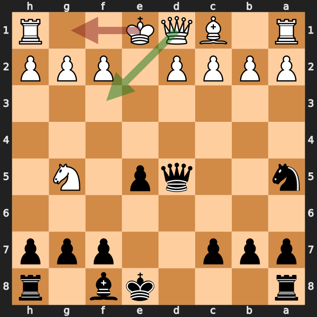
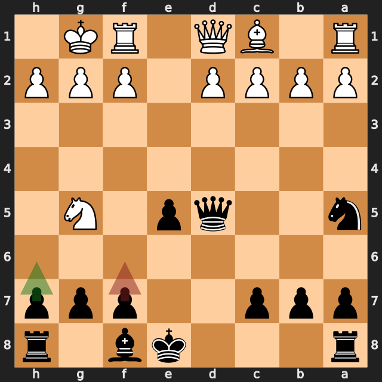
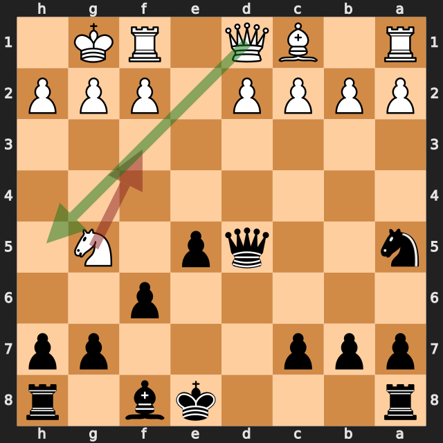
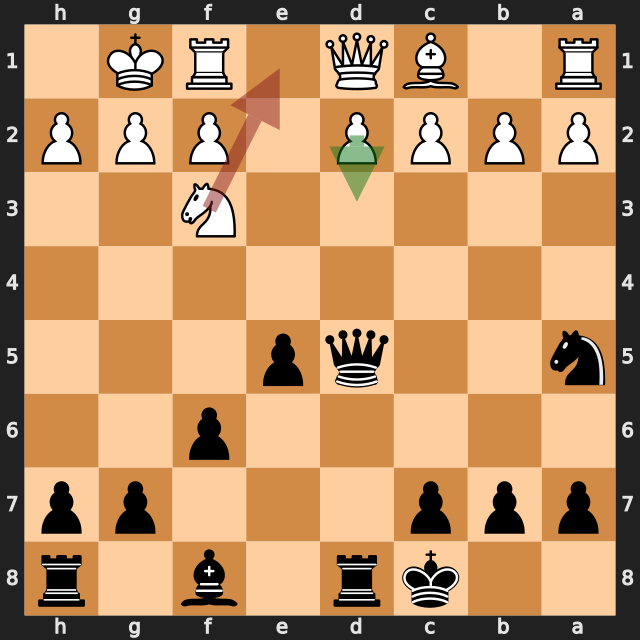
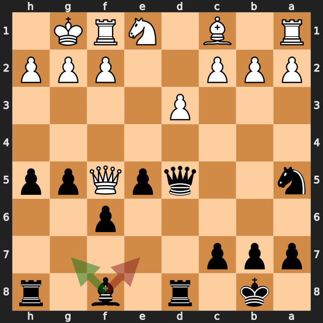
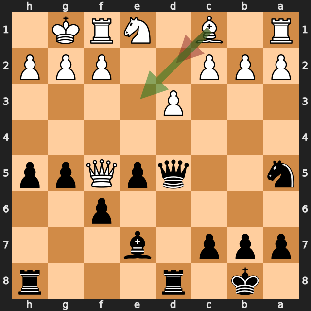

# Harshit27092018 vs zbxah

結果: 0-1 / 日付: 2026.09.19

これはStockfishの計算結果に基づく解説下書きです。候補の選定と戦術・戦略の説明はAIアシスタントで仕上げます。

評価値は常に白視点（＋は白有利）。メイトは数値評価と分けて表示します。

「期待スコア」はsf16モデルによる勝ち＋引き分けの半分の推定値で、人間の勝率ではありません。分類は暫定です。

## 注目局面 10.O-O

実戦は **O-O**。推奨候補は **Qf3** です。

推奨候補の評価: -0.38 / 実戦手を選んだ場合: -0.75。

手番側の期待スコアの低下: 10.2ポイント。

推奨手からの参考変化: Qf3 → Qd7 → Qh3 → Qxh3 → Nxh3 → Nc6

実戦手からの参考変化: O-O → h6 → Qh5 → Be7 → Nf3 → Nc6

<!-- AIアシスタント: PVと盤面で裏付けられる狙い、相手の応手、改善点を説明する。未検証の戦術名や心理を創作しない。 -->

## 注目局面 10...f6

実戦は **f6**。推奨候補は **h6** です。

推奨候補の評価: -0.63 / 実戦手を選んだ場合: -0.44。

手番側の期待スコアの低下: 4.4ポイント。

推奨手からの参考変化: h6 → Qh5 → Nc6 → d3 → g6 → Qf3

実戦手からの参考変化: f6 → Qh5+

<!-- AIアシスタント: PVと盤面で裏付けられる狙い、相手の応手、改善点を説明する。未検証の戦術名や心理を創作しない。 -->

## 注目局面 11.Nf3

実戦は **Nf3**。推奨候補は **Qh5+** です。

推奨候補の評価: -0.46 / 実戦手を選んだ場合: -1.24。

手番側の期待スコアの低下: 38.0ポイント。

第2候補との評価差が大きく、最善候補を見つけることが重要な局面です。唯一手かどうかは追加検証が必要です。

推奨手からの参考変化: Qh5+ → g6 → Qf3 → Qxf3 → Nxf3 → Nc6

実戦手からの参考変化: Nf3 → O-O-O

<!-- AIアシスタント: PVと盤面で裏付けられる狙い、相手の応手、改善点を説明する。未検証の戦術名や心理を創作しない。 -->

## 注目局面 12.Ne1

実戦は **Ne1**。推奨候補は **d3** です。

推奨候補の評価: -1.08 / 実戦手を選んだ場合: -1.30。

手番側の期待スコアの低下: 10.3ポイント。

推奨手からの参考変化: d3 → Nc6 → Be3 → Be7 → a3 → g5

実戦手からの参考変化: Ne1 → h5 → d3 → g5 → c3 → Qd7

<!-- AIアシスタント: PVと盤面で裏付けられる狙い、相手の応手、改善点を説明する。未検証の戦術名や心理を創作しない。 -->

## 注目局面 15...Be7

実戦は **Be7**。推奨候補は **Bg7** です。

推奨候補の評価: -1.44 / 実戦手を選んだ場合: -1.18。

手番側の期待スコアの低下: 8.4ポイント。

推奨手からの参考変化: Bg7 → Be3

実戦手からの参考変化: Be7 → Nf3 → Nc6 → Be3 → Rhf8 → a3

<!-- AIアシスタント: PVと盤面で裏付けられる狙い、相手の応手、改善点を説明する。未検証の戦術名や心理を創作しない。 -->

## 注目局面 16.Bd2

実戦は **Bd2**。推奨候補は **Be3** です。

推奨候補の評価: -1.14 / 実戦手を選んだ場合: -1.64。

手番側の期待スコアの低下: 12.8ポイント。

推奨手からの参考変化: Be3 → b6 → Nf3 → Nb7 → Nd2 → g4

実戦手からの参考変化: Bd2 → Nc6 → c3 → Rhg8 → Be3 → a6

<!-- AIアシスタント: PVと盤面で裏付けられる狙い、相手の応手、改善点を説明する。未検証の戦術名や心理を創作しない。 -->
