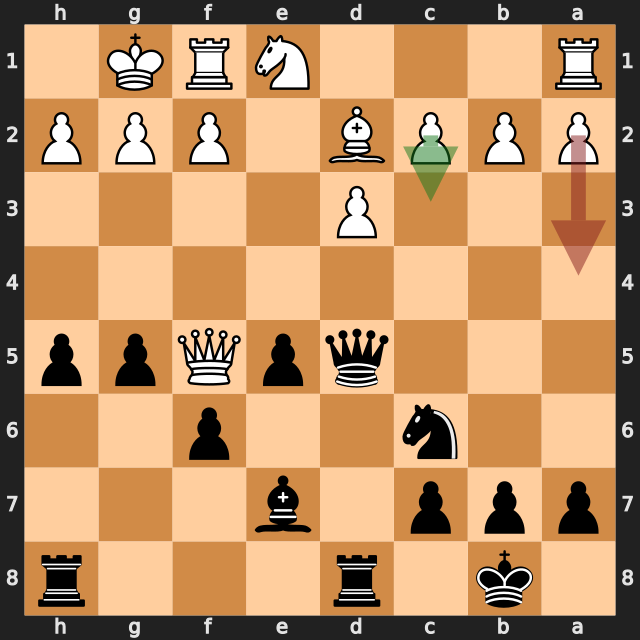
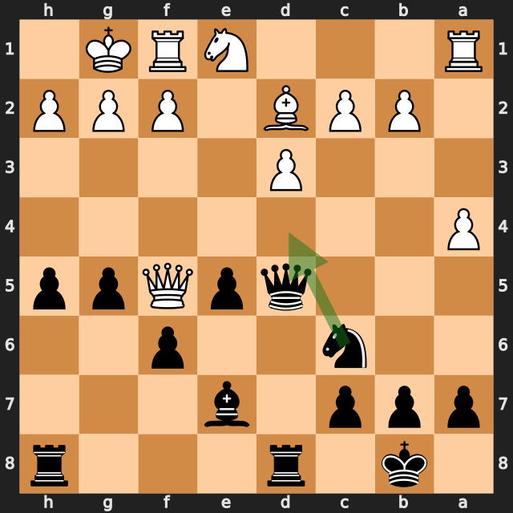
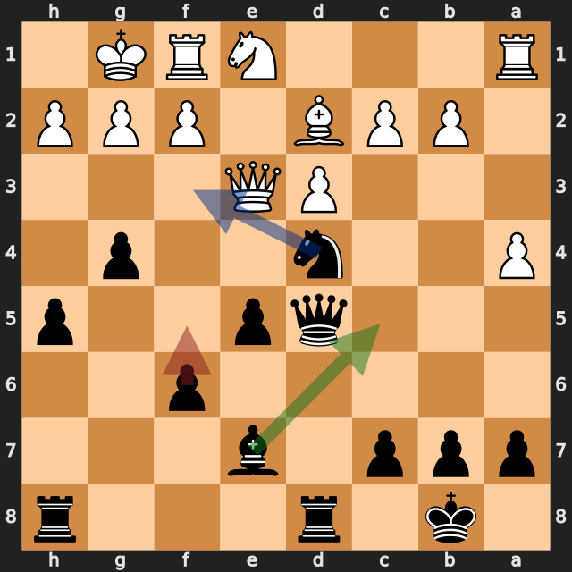
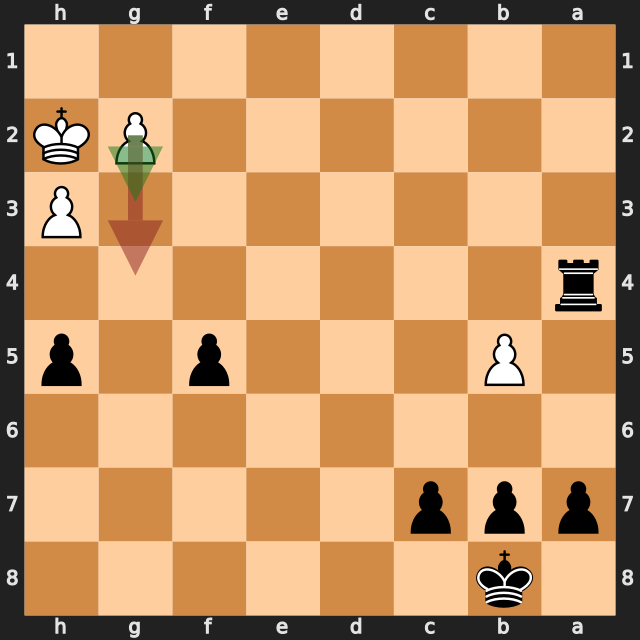

# 白の17.a4をとがめた一局——lichess、黒番の振り返り

[棋譜（PGN）](game.pgn) · [全局面の解析](game.analysis.json) · [重要局面の再確認](verification.analysis.json) · [lichessの対局ページ](https://lichess.org/8z8U1CbM)

2026年9月19日／lichess・レーティング戦（30分＋20秒）／白：Harshit27092018（1667）／黒：筆者（1696）／結果：0–1（43手でチェックメイト）

この対局は、白の **17.a4** で大きく傾きました。黒は **17...Nd4!** とすぐにとがめ、そのまま勝ち切っています。一方で、大差になった後の **19...f5**、**20...gxf3** には、もっと強い手がありました。この記事では、この3つの場面と、白が逃した **11.Qh5+** を振り返ります。

以下の評価値はすべて白視点で、マイナスが黒有利です。数値は今回の探索での目安で、確定的な勝率ではありません。局面図は黒側から見た向きです。赤は実戦手、緑は検討候補、青は緑の手の次の狙い（4番目の図のみ）を表します。

白の手ごとに、最善候補との評価の差を並べると、どこで対局が動いたかが分かります。

| 白の手 | 最善候補（評価） | 実戦（評価） | 差 |
|---|---|---|---|
| 7.Bxd7+ | Qe2（+0.25） | Bxd7+（−0.31） | 約0.6 |
| 11.Nf3 | Qh5+（−0.55） | Nf3（−1.16） | 約0.6 |
| **17.a4** | c3（−1.67） | a4（−6.07） | **約4.4** |

## 1. 白が逃した一手——10...f6 と 11.Qh5+

序盤は **4.Ng5 d5 5.exd5 Na5** のツーナイツ・ディフェンスです。**10...f6** は、g5のナイトに当てる自然な手でした。ただ、6秒の再確認では最善候補は **10...h6**（約 −0.77）で、実戦の10...f6は約 −0.54。差は約0.2で、大きな問題ではありません。

注目したいのは、f6にポーンを進めた結果、f7が空き、e8–h5の斜めが開いたことです。白には **11.Qh5+** があり、python-chessでも合法な王手であることを確認しました。参考変化は **11.Qh5+ g6 12.Qf3**。評価は約 **−0.55** です。

実戦の **11.Nf3** は約 **−1.16** で、黒有利が0.6ほど広がりました。以後は **11...O-O-O** と展開し、黒が主導権を握っています。

**今回の学び：** ポーンでナイトを追い払う手は、動かしたポーンの後ろの斜めやマスを開ける。指す前に「自分のキングに向かう線が開かないか」を一度確認する。今回は白が見逃してくれました。

## 2. 対局の分岐点——白の17.a4と、黒の17...Nd4!

黒はg5・h5と進めて白クイーンをf5へ追い、**16...Nc6** まで進みました。ここで白の最善候補は **17.c3**（約 −1.67）か **17.Be3**（約 −1.73）。黒が優位ではありますが、まだ戦える局面です。

実戦の **17.a4** は約 **−6.07** で、最善候補より約4.4も黒に傾きました。理由は、**17.c3** ならcのポーンがd4に利いて、黒ナイトの跳び込みを防げるからです。17.a4ではそれができません。

**17...Nd4!** で、ナイトは白クイーン（f5）とc2のポーンに同時に当たります。しかも、白の駒でd4に利いているものはありません（python-chessで確認）。参考変化は **17...Nd4 18.c4 Nxf5 19.cxd5 Rxd5** とクイーン同士を交換する形で、評価は約 **−5.51** でした。

他の候補は **17...h4**（約 −2.81）、**17...g4**（約 −2.48）、**17...a6**（約 −2.43）で、Nd4との差は約3ポーン分あります。唯一手かどうかまでは断定しませんが、この探索条件では抜けて有力でした。

**今回の良かった点：** 相手のミスの直後に、「取られずに跳び込めるマス」を探して見つけました。

## 3. 勝勢でも脅威を保つ——19...f5 と 20...gxf3

その後の展開は黒の大差でしたが、19手目と20手目には、さらに強い手がありました。

**19...f5** は約 **−5.02**。最善候補の **19...Bc5** は約 **−7.58** で、約2.6の差があります。

**19...Bc5** の意味は、ビショップc5・ナイトd4・白クイーンe3が同じ斜めに並ぶことです。次の **...Nf3+** は王手をかけながら、ビショップがクイーンを狙う発見攻撃になります（**20.Bb4 Nf3+** で合法な王手であることを確認）。参考変化は **19...Bc5 20.Bb4 Nf3+ 21.Nxf3 Bxe3 22.fxe3 Qc6** です。

続く **20...gxf3**（アンパッサン）はポーンを1つ得る手ですが、約 **−5.27**。**20...Bc5**（約 −8.07）や **20...Nb3**（約 −7.25）の方が上でした。約2.8の差です。

ただし、実戦では **21.Nxf3 Bc5 22.Kh1 Nxc2** と、結局Bc5も指せており、勝勢は保たれています。これは「負けにつながる悪手」ではなく、「もっと早く、もっと大きく勝てた手」です。

**今回の学び：** 自分の駒と相手のクイーンが一直線に並んだら、発見攻撃を探す。勝勢のときは、ポーンを取るより、相手にとって受けにくい脅威を優先する。

## 4. 34.g4は結果を変えたか——終盤の仕上げ

34手目では、黒がルーク＋ポーン2つの駒得です。白の **34.g4** は、6秒の再確認で黒の **11手メイト**（エンジン表記 #−11）が見える手でした。最善候補の **34.g3** は約 −8.96、**34.Kg3** は約 −10.08 で、どれを指しても黒の大差に変わりありません。

つまり、**勝敗を分けたのは17.a4で、34.g4は結果を変えた手ではありません。** 短い探索では34.g4の時点で詰みは見えず、詰みの見通しは6秒探索で初めて出ました。

その後の黒は正確でした。**34...fxg4 35.hxg4 Rxg4** から、**a5–a4–a3–a2–a1=Q** とaポーンを進め、**43...Qh1#** で決めています。0.3秒の全局面解析では、35.hxg4以降、黒が指すたびに詰みまでの手数が **#−9 → #−1** と1つずつ縮んでいました。最終局面がチェックメイトであることは、python-chessでも確認しました。

## 次の対局で意識したいこと

- **ポーンを進める前に、開く線を確認する。** 10...f6でe8–h5の斜めが開きました。
- **相手のミスの後は、跳び込めるマスを探す。** 17...Nd4は、白の駒がd4に利いていなかったから成立しました。
- **勝勢でも、脅威を保つ手を優先する。** 一直線に並んだ駒は、発見攻撃のサインです。

---

解析：Stockfish 19、1スレッド、Hash 128MB。全局面0.3秒、候補12局面を各2秒・MultiPV 3で解析しました。記事で扱った局面（7.Bxd7+、10...f6、11.Nf3、17.a4、17...Nd4、19...f5、20...gxf3、34.g4、34...fxg4）は、各6秒・MultiPV 4で再確認しています。評価値は本文で明示した探索の値であり、確定的な勝率ではありません。

自動選定された重要局面には17.a4と34.g4が入りませんでした。期待スコアは大差の局面で差が出にくく、軽量解析（0.3秒）では34.g4のメイトも見えなかったためです。このため、追加解析で確認しています。`verification.analysis.json` には15...Be7も含まれますが、差が約0.25と小さいため本文では扱っていません。

PGNに含まれるlichessの評価コメントは使わず、数値はすべて本ツールのStockfishで計算し直しています。黒の実名は補っていません。
