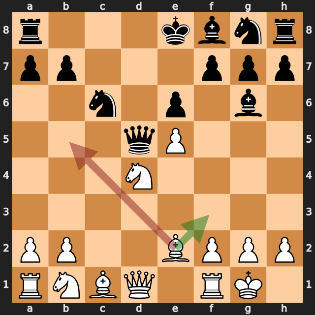
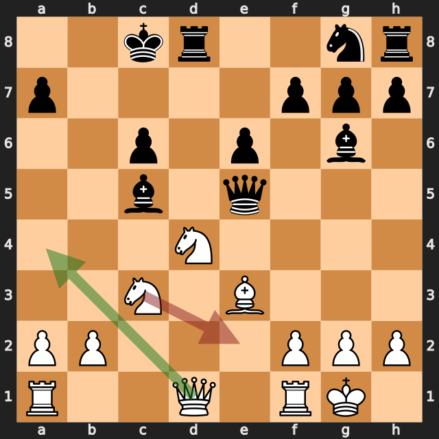
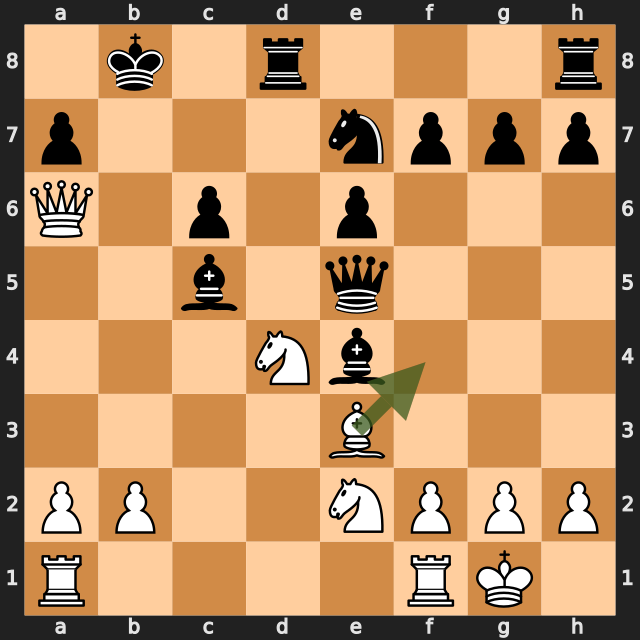
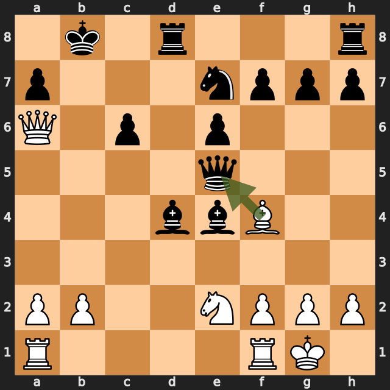

# 王手の順番と、クイーンを縛るビショップ――町田シルバーウィークオープン、白番の振り返り

2026年9月19日、町田シルバーウィークオープン。白番・田中智、黒番・Le Tri Khoa（1747）。カロカン・ディフェンスのアドバンスから、中央を開き、黒キングに迫った一局を振り返る。

棋譜の章名では白勝ちと記録されている。提供された指し手は **18.Bxe5+** までで、PGNの結果欄は未確定の `*`。以下はこの範囲を分析したもので、投了のタイミングやその後の指し手は補っていない。また、対局中の実際の思考や感情ではなく、白番から見た検討内容をまとめている。

この一局でよかったのは、ポーンの数だけにとらわれず、展開と相手キングへの圧力を形にしたこと。最後の **17.Bf4!** は、その積み重ねが具体的な戦術になった一手だった。一方で、ひとつ前の王手には改善の余地があった。

## 序盤――中央を開いて、先にキングを安全に

実戦は次のように進んだ。

```pgn
1. e4 c6 2. d4 d5 3. e5 Bf5 4. Nf3 e6 5. Be2 c5
6. c4 cxd4 7. Nxd4 Bg6 8. O-O Nc6 9. cxd5 Qxd5
```

**6.c4** は中央に直接働きかける積極的な選択。ただし、これだけで白が有利になるわけではない。Stockfishは黒に **6...dxc4** を挙げ、この場合はほぼ互角と見ている。白には **6.Be3** や **6.O-O** という、展開を優先する候補もあった。

実戦で白に機会が生まれたのは **7...Bg6**。黒には **7...Bxb1 8.Rxb1 Bb4+** と、白の展開やキングの位置に働きかける選択肢があった。ビショップを引いた実戦では、白がキャスリングして中央を開き、黒クイーンを攻撃目標にできた。

振り返りでは「c4を突けば攻めになる」と覚えるより、**中央を開くタイミングと、双方の展開・キングの安全を一緒に見る**ことを持ち帰りたい。

## 10.Bb5――ピンは魅力的でも、展開を進める手と比較したい



```pgn
10. Bb5 O-O-O 11. Bxc6 bxc6 12. Be3
```

**10.Bb5** はc6のナイトをキングに対してピンする自然な手。ただし黒は **10...O-O-O** でキングを移し、同時にd8へルークを運べる。見た目のピンだけで圧力が持続すると判断しないことが大切だった。

最初の詳細解析では **10.Be3** が第一候補。追加解析では **10.Bf3** が上位となり、候補順位には揺れがあった。共通するのは、実戦のBb5以外にも有力な駒の配置があること。特にBe3は、未展開のビショップを出しながらd4のナイトを支える、理解しやすい改善候補だ。

実戦の **11.Bxc6** 自体は詳細解析でも第一候補だった。しかし、黒の取り返しは **11...bxc6** に限らない。

```pgn
11... Qxd4 12. Qxd4 Rxd4 13. Bf3
```

この変化では黒がd4のナイトを取り、クイーン交換に持ち込める。白のビショップはc6から退く。白はなお指しやすいものの、実戦ほど直接的なキング攻めにはならない。

実戦の **11...bxc6** ではb7のポーンが移動し、黒キング周辺が開いた。ここからは、その弱点を利用する展開が重要になる。

## 14.Nce2――守りを足す前に、攻めながら支える方法を探す



```pgn
12... Bc5 13. Nc3 Qxe5 14. Nce2 Ne7 15. Qa4 Be4
```

**13.Nc3** は展開しながらd5のクイーンを攻撃する手。黒は **13...Qxe5** とポーンを取ったが、白は駒の活動と黒キングへの圧力を保っている。

実戦の **14.Nce2** は、d4のナイトをさらに支える手だった。悪手と断じるほどではなく、追加解析でも白有利。ただ、ここでは一手早い **14.Qa4!** がより積極的だった。

```pgn
14. Qa4 Bxd4 15. Rfd1 Qc7 16. Bxd4
```

この変化はpython-chessで合法性と駒の取り合いを確認した。ポイントは、d4のナイトを取られても、すぐ取り返すだけでなく **Rfd1** を挟めること。dファイルのルークとe3のビショップが連携し、その後Bxd4で取り返す。

追加解析の評価は、Qa4が約 **+2.4**、Nce2が約 **+1.9**。いずれも白視点だ。大きな失敗というより、**受けを一枚増やす前に、相手へ問題を出し続ける手を探せた場面**だった。

## 16.Qa6+――王手を先にすると、相手に選択肢が生まれる


```pgn
15... Be4 16. Qa6+ Kb8
```

実戦の王手はわかりやすい。ただ、今回のいちばん大切な改善点は、ここで **16.Bf4!** を先に検討することだった。e3のビショップをf4へ出し、e5のクイーンを直接攻撃できる。

Stockfishは最初の詳細解析でも追加解析でもBf4を第一候補とし、白約 **+3.1**。黒の応手は探索によって **...Qxf4** と **...Qh5** に分かれたため、この時点でクイーンが必ず取れるとは言わない。王手を挟まずクイーンに働きかけることが、強い主導権につながるという評価だ。

一方、実戦の **16.Qa6+** には、黒に **16...Kd7!** という粘り方があった。

```pgn
16. Qa6+ Kd7 17. Nxe6 Bd6 18. N6f4
```

キングが中央へ出る意外な受けだが、この変化なら白の優位は約 **+1.3〜+1.5** に縮まる。白の攻めが消えるわけではないものの、実戦のようには進まない。

王手は相手の応手を限定する。その一方で、**どこへキングを動かしてしまうか**も読まなければならない。次回は「王手だから先に指す」のではなく、王手とクイーンへの攻撃を並べ、手順の違いを比較したい。

## 17.Bf4!――b8のキングとe5のクイーンが一直線に



```pgn
16... Kb8 17. Bf4! Bxd4 18. Bxe5+
```

黒がb8へ逃げたところで、**17.Bf4!** が決まった。今回の締めくくりとして、もっともよかった一手だ。

ビショップをf4へ出すと、次の斜線ができる。

**白Bf4 → 黒Qe5 → d6 → c7 → 黒Kb8**

e5の黒クイーンはキングの前にあり、この斜線から自由に外れられない。絶対ピンである。黒には **17...Qxf4 18.Nxf4** という応手もあるが、これもクイーンを手放すことになる。e2のナイトがf4を守っている点まで含めて成立する戦術だ。

黒は実戦で **17...Bxd4** とナイトを取り、白が **18.Bxe5+** でクイーンを取った。なお、クイーンを丸ごとただ取りしたわけではなく、続く **18...Bxe5** で白ビショップも取り返される。

それでも最終局面の追加解析は白約 **+3.8**。黒が最善に応じても、白が勝勢という評価だった。17...Bxd4だけで突然勝ちになったのではなく、17.Bf4の時点ですでに大きな優位を築いていた、と捉えたい。

## 続けるなら――ルークを働かせて優位を形にする



提供棋譜は18.Bxe5+まで。以下は実戦ではなく、検討上の続きである。

```pgn
18... Bxe5 19. Rad1
```

白はクイーンを残している一方、黒には二枚のビショップとナイトがある。黒の駒の連携にも注意は必要だ。**19.Rad1** と開いたdファイルへルークを出し、駒を働かせる方針が自然になる。

「クイーンを取ったから終わり」と考えるのではなく、ルークを参加させ、黒の反撃を抑えながら優位を拡大する。勝勢を実際の勝ちへつなげる際にも、展開と駒の連携というテーマは変わらない。

## 次の対局へ持ち帰ること

- **王手とクイーンへの攻撃の手順を比較する。** 今回なら16.Qa6+より先に16.Bf4を考える。
- **守備を足す前に、活動的な手で対応できないかを見る。** 14.Nce2と14.Qa4の比較がよい教材になる。
- **取り返しを決めつけない。** 11.Bxc6には、黒の11...Qxd4という別の取り方もあった。

白番として最も評価したいのは、黒キングの位置を利用し、17.Bf4という具体的な戦術を見つけて実行できたこと。そこへ至るまでの手順をもう少し磨ければ、相手に粘る余地を与えずに攻めを進められる。勝った一局だからこそ、最後の好手と、その一手前の改善点をセットで覚えておきたい。

---

### 解析について

Stockfish 16.1を使用。全局面を各0.3秒、選定12局面を各4秒・候補3手で解析し、記事に使う主要局面と最終局面を各5秒・候補3手で追加確認した。参考変化はpython-chessで再生確認済み。評価値はすべて白視点で、プラスが白有利。有限の探索による参考値であり、勝率ではない。候補順位や変化には探索による揺れがある。

評価値・候補手はエンジンの計算結果、狙いの説明と次回への課題は盤面と変化を確認したうえでの解釈。図は白から見た指す前の局面で、緑が追加解析の第一候補、赤が実戦手。同じ手の場合は緑が重なる。

[元の棋譜](https://lichess.org/study/0xHrU6zo/QfrnsDDH) / [保存PGN](game.pgn) / [基本解析JSON](game.analysis.json) / [追加解析JSON](supplemental.analysis.json)

基本解析JSONと自動下書きには、解析開始時の白名mutaito-stが残っている。記事と保存PGNはユーザー指定の田中智に修正済み。
