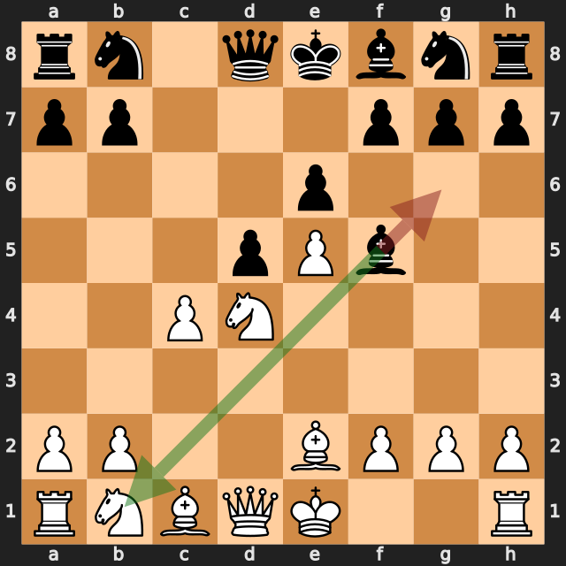
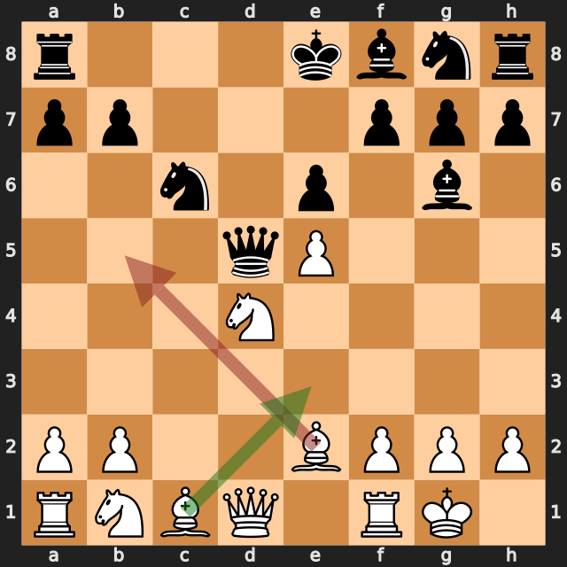
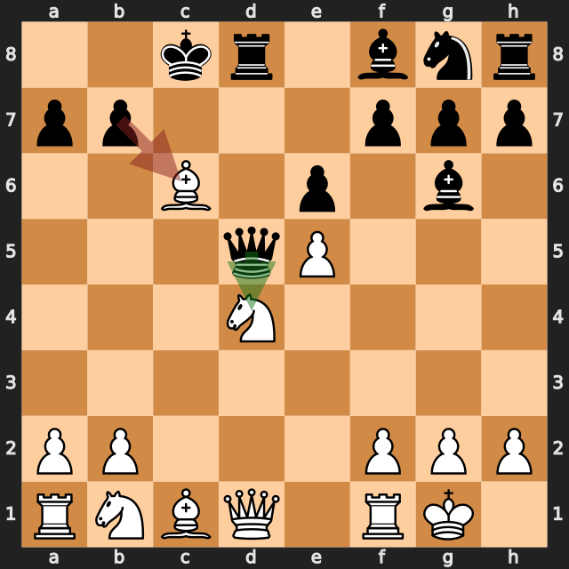
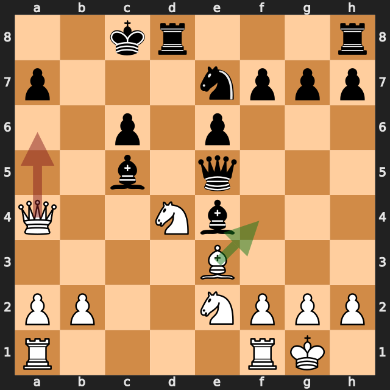
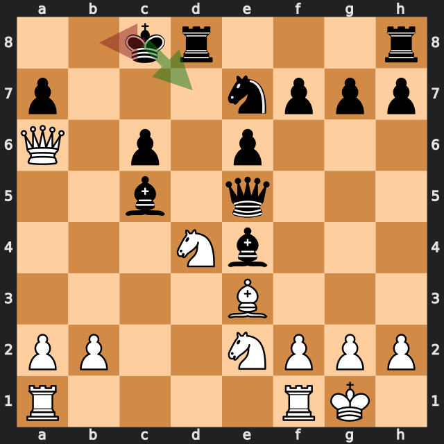

# mutaito-st vs Le Tri Khoa

結果: * / 日付: 2026.09.19

これはStockfishの計算結果に基づく解説下書きです。候補の選定と戦術・戦略の説明はCodexで仕上げます。

評価値は常に白視点（＋は白有利）。メイトは数値評価と分けて表示します。

「期待スコア」はsf16モデルによる勝ち＋引き分けの半分の推定値で、人間の勝率ではありません。分類は暫定です。

## 注目局面 7...Bg6

実戦は **Bg6**。推奨候補は **Bxb1** です。

推奨候補の評価: +0.17 / 実戦手を選んだ場合: +2.03。

手番側の期待スコアの低下: 49.2ポイント。

第2候補との評価差が大きく、最善候補を見つけることが重要な局面です。唯一手かどうかは追加検証が必要です。

推奨手からの参考変化: Bxb1 → Rxb1 → Bb4+ → Kf1 → Ne7 → Bg5

実戦手からの参考変化: Bg6

<!-- Codex: PVと盤面で裏付けられる狙い、相手の応手、改善点を説明する。未検証の戦術名や心理を創作しない。 -->

## 注目局面 10.Bb5

実戦は **Bb5**。推奨候補は **Be3** です。

推奨候補の評価: +1.86 / 実戦手を選んだ場合: +1.03。

手番側の期待スコアの低下: 19.7ポイント。

推奨手からの参考変化: Be3 → Nxd4 → Bxd4 → Bc5 → Qa4+ → Kf8

実戦手からの参考変化: Bb5 → O-O-O → Bxc6 → Qxd4 → Qxd4 → Rxd4

<!-- Codex: PVと盤面で裏付けられる狙い、相手の応手、改善点を説明する。未検証の戦術名や心理を創作しない。 -->

## 注目局面 11...bxc6

実戦は **bxc6**。推奨候補は **Qxd4** です。

推奨候補の評価: +0.96 / 実戦手を選んだ場合: +2.09。

手番側の期待スコアの低下: 24.9ポイント。

第2候補との評価差が大きく、最善候補を見つけることが重要な局面です。唯一手かどうかは追加検証が必要です。

推奨手からの参考変化: Qxd4 → Qxd4 → Rxd4 → Bf3 → Ne7 → Be3

実戦手からの参考変化: bxc6 → Be3 → Bc5 → Nc3 → Qxe5 → Qa4

<!-- Codex: PVと盤面で裏付けられる狙い、相手の応手、改善点を説明する。未検証の戦術名や心理を創作しない。 -->

## 注目局面 16.Qa6+

実戦は **Qa6+**。推奨候補は **Bf4** です。

推奨候補の評価: +3.16 / 実戦手を選んだ場合: +1.26。

手番側の期待スコアの低下: 8.3ポイント。

推奨手からの参考変化: Bf4 → Qxf4 → Nxf4 → Rxd4 → Qa6+ → Kb8

実戦手からの参考変化: Qa6+ → Kd7

<!-- Codex: PVと盤面で裏付けられる狙い、相手の応手、改善点を説明する。未検証の戦術名や心理を創作しない。 -->

## 注目局面 16...Kb8

実戦は **Kb8**。推奨候補は **Kd7** です。

推奨候補の評価: +1.51 / 実戦手を選んだ場合: +3.32。

手番側の期待スコアの低下: 2.4ポイント。

推奨手からの参考変化: Kd7 → Nxe6 → Bd6 → N6f4 → Nd5 → Qxa7+

実戦手からの参考変化: Kb8 → Bf4 → Qxf4 → Nxf4 → Bxd4 → Rfe1

<!-- Codex: PVと盤面で裏付けられる狙い、相手の応手、改善点を説明する。未検証の戦術名や心理を創作しない。 -->
