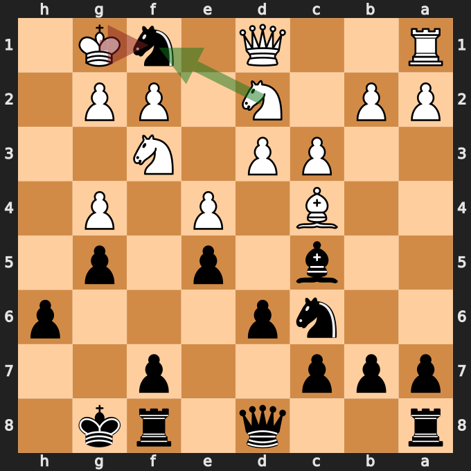
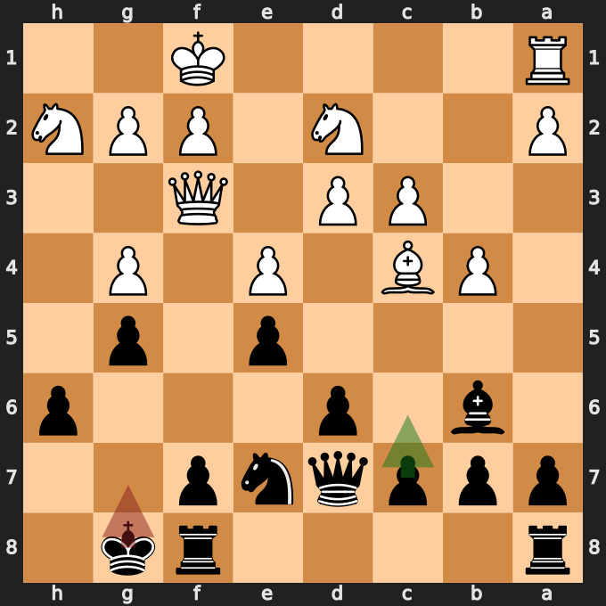
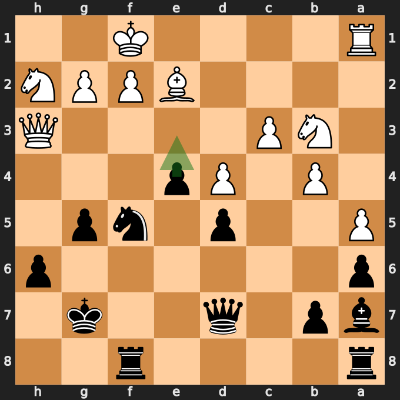
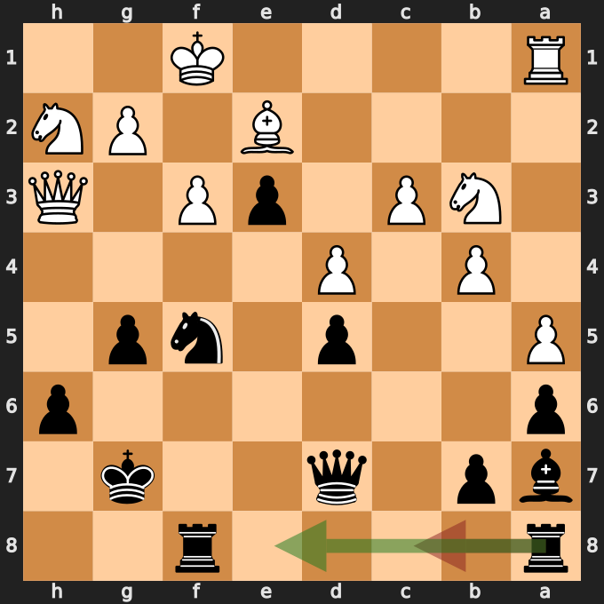
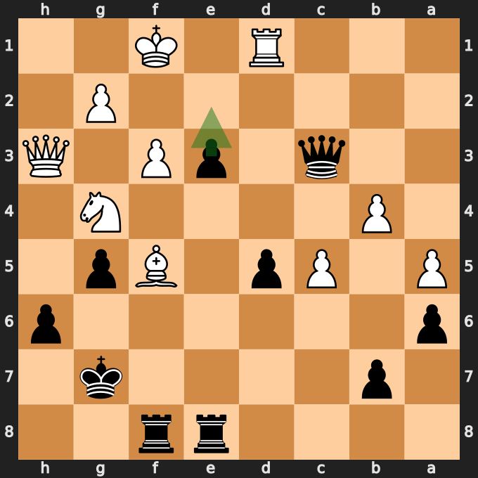

# 中央の前進から昇格メイトへ——町田シルバーウィークオープン、黒番の振り返り

[棋譜（PGN）](game.pgn) · [全局面の解析](game.analysis.json) · [構想の追加解析](focus.analysis.json) · [重要局面の再確認](verification.analysis.json)

2026年9月19日／白：Vyom Walia（1629）／黒：筆者／結果：0–1（34手でチェックメイト）

この対局の良かった点は、序盤に得た駒得を、中央のポーンとルークの活動につなげたことです。**19...d5、23...e4、25...e3** と前進させたポーンが、最後には **32...e2+、33...e1=Q+** の主役になりました。

ただし、序盤の交換だけで黒の優勢が確定したわけではありません。白の取り返し方が大きな分岐点でした。また、優位を広げる途中には、中央の準備を優先するとより明快だった場面があります。

以下の評価値はすべて白視点です。マイナスが黒有利で、数値は今回の探索での目安です。局面図は黒側から見た向き。赤は実戦手、緑は検討候補で、実戦手を推奨する図では緑だけを表示しています。

## 1. 序盤の転機は「何で取り返すか」——13.Kxf1

**11...Nxg3 12.hxg4 Nxf1** という交換で、黒は白のルークを取りました。13手目にナイトを取り返された後、駒の構成は黒が2ルーク・ビショップ・ナイト、白がルーク・ビショップ・2ナイトです。黒がルーク対ナイトの交換得になります。

しかし、ここで白が **13.Nxf1!** と取り返すと、今回の解析ではほぼ互角です。8秒の再確認では約 **+0.30**。白のキングをg1に残したまま、d2のナイトをf1、さらにg3へ使うことができます。参考変化は **13.Nxf1 Bb6 14.Ng3 Ne7 15.d4**。黒のキング前も...h6、...g5で動いているため、交換得だけを見て安心できる局面ではありません。

実戦の **13.Kxf1** はキングが中央寄りに出て、黒の攻めの対象になります。8秒の再確認では約 **−1.29** で、13.Nxf1との差が大きく出ました。黒の候補は **13...Qf6**。実戦の **13...Qd7** でも黒有利を保っています。

**今回の学び：** 交換で駒を得たときは、相手がどの駒で取り返すかまで読む。今回の組み合わせは実戦で成功しましたが、「ルークを取れるから必ず有利」とは限りません。

## 2. 優位を広げるなら中央の準備——16...Kg7

実戦は **16.Qf3 Kg7**。この局面では **16...c6** が有力でした。目的は次の...d5を準備し、中央でルークやビショップを働かせることです。

参考変化は **16...c6 17.Kg1 d5 18.Bb3 Rad8**。まず中央を押し、ルークを開きそうなファイルに置く、という自然な手順です。

8秒の再確認では16...c6が約 **−1.19**、実戦の16...Kg7が約 **−1.01**。さらに16...a5も約−1.21で有力でした。差は小さく、...c6だけが正解という局面ではありません。自動分類は短い探索で16...Kg7を大きなミス候補にしましたが、深く読むと差は縮まっています。ここは大きな失敗ではなく、**中央の準備を先に考える練習になる場面**として捉えます。

白は続いて **17.Nb3** と指しましたが、解析では **17.Kg1** の方が粘れました。実戦の **17...c6** は、中央へ方針を戻す良い手です。

**今回の学び：** 相手のキングが中央にいるときは、キングの小さな移動よりも、中央を開く準備を先に候補へ入れる。

## 3. この対局の中心となった構想——...d5、...e4、...e3

**19.d4に19...d5!** と応じたのは良い判断でした。黒は白の中央の動きに受け身にならず、自分のポーンを前進させています。追加解析でも...d5が最上位候補で、評価は約 **−2.33**。

実戦は **20.exd5 cxd5 21.Be2 f5 22.a5 Ba7 23.Qe3 e4!**。...f5は最上位候補ではありませんでしたが、黒の優位を保っています。続く **23...e4** は追加解析でも最上位候補でした。中央の空間を取りながら、eポーンをさらに前へ進める構想です。

**24.gxf5 Nxf5 25.Qh3 e3!** も有力。追加解析では約 **−2.46** で、...Rae8とほぼ同水準でした。e3のポーンはd2とf2を押さえ、白に対処を迫ります。白のfポーンがf3へ進むと、e3のポーンはパスポーンになります。

ここでは「前進すればすぐ勝つ」わけではありません。解析の参考変化にも **25...e3 26.Nc5 Qd6 27.f3 Rae8** とあり、**進んだポーンをルークで支えること**が次の仕事です。

**今回の良かった点：** ポーンの前進が単発ではなく、中央の制圧、白の駒の制限、昇格の脅威へとつながっています。この対局で再現したい構想です。

## 4. ルークは攻めの中心へ——26...Rac8より...Rae8

**26.f3** に対して、実戦は **26...Rac8**。cファイルにルークを出すのも自然ですが、この局面では **26...Rae8** を優先したいところです。すでにe3まで進んだポーンの後ろへ、ルークを直接配置できます。

8秒の再確認でも...Rae8が約 **−2.54**、...Rac8が約 **−1.58**。どちらも黒有利ですが、攻めの中心であるeファイルへ置く方が優位を維持しやすいと評価されています。

実戦の **27.Nc5 Bxc5** に対し、白には **28.bxc5** がより粘る手として示されました。しかし白は **28.dxc5** を選び、黒の優位が再び広がっています。したがって、この後に勝てたことと、26...Rac8が最も正確だったかは分けて考えると学びが得られます。

なお、**29...Qe5** の場面でも、すでに **29...Rce8** や **29...e2+** が有力でした。8秒探索では実戦手が約−2.96、これらの候補が約−3.8。黒は実戦手でも十分有利ですが、ポーンとルークを組み合わせる構想を少し早く実行できました。

実戦では後に **31...Rce8!** とルークをeファイルへ戻しました。この手は追加解析の最上位候補です。ここで、パスポーンとルークの協力が整いました。

**今回の学び：** 開いたファイルが複数あるときは、「どのファイルが自分の具体的な脅威を支えるか」で選ぶ。この局面ではeポーンの前進と昇格が判断の軸です。

## 5. 駒を取り返すより強い手——32...e2+!

白は **32.Bxf5** で黒のナイトを取りました。ここでそのビショップへの対応に目を奪われず、**32...e2+!** と王手でポーンを進めたのが決定的です。

実戦の終わり方は次の通りです。

**32...e2+ 33.Kf2 e1=Q+! 34.Rxe1 Qxe1#**

昇格したクイーンはすぐに取られます。しかし、その交換によって白のルークがe1へ移り、黒の元のクイーンがc3からd2を通ってe1へ入り、チェックメイトになります。昇格駒の価値そのものではなく、**王手で応手を強制し、相手のルークをe1へ誘導すること**がポイントです。

白が **33.Kg1** と逃げた場合は、同じ短いメイトにはなりません。その場合には **33...exd1=Q+** とルークを取りながら昇格する変化があり、黒は大きな優位を維持します。実戦の33.Kf2に対する2手メイトと、32...e2+の時点での勝勢は区別しておきます。

最終局面はpython-chessでも、白が王手を受けていて合法な応手がないことを確認しました。

## 次の対局で意識したいこと

- **駒得の計算は相手の取り返しまで。** 今回は13.Nxf1と13.Kxf1で評価が大きく違いました。
- **有利になったら、中央の前進とルークの配置をセットで考える。** ...c6–...d5と...Rae8が具体例です。
- **取られた駒にすぐ反応せず、王手を先に探す。** 32...e2+は、今回とても良かった判断でした。

---

解析：Stockfish 16.1、1スレッド、Hash 128MB。全局面0.3秒、候補14局面を各4秒・MultiPV 3で解析し、構想に関わる黒の手を追加解析しました。重要な比較は別途8秒探索でも再確認しています。評価値は本文で明示した探索の値であり、確定的な勝率ではありません。

元の投稿はResultタグと終端記号が未確定でしたが、実際の最終局面が黒のチェックメイトなので、保存用PGNは0–1に正規化しました。対局者名・レーティングは提供された章名に基づき、黒の実名は補っていません。
