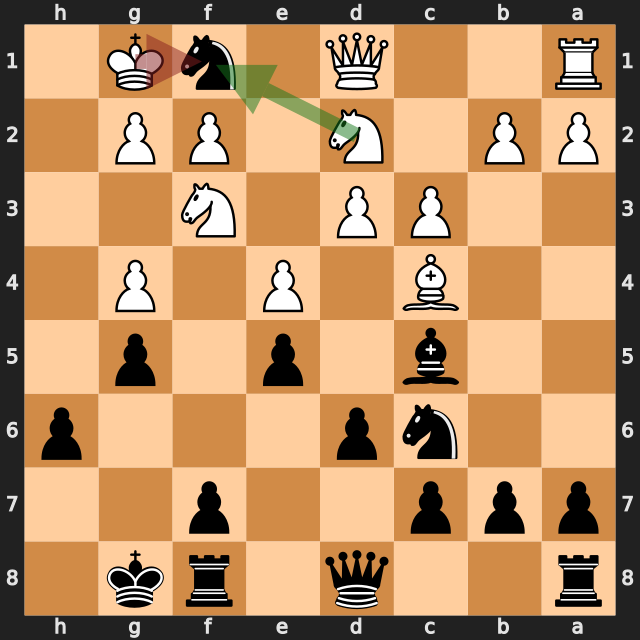
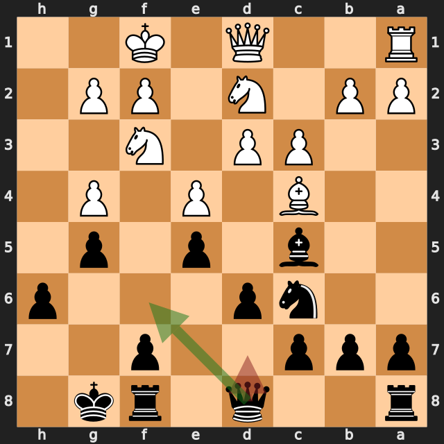
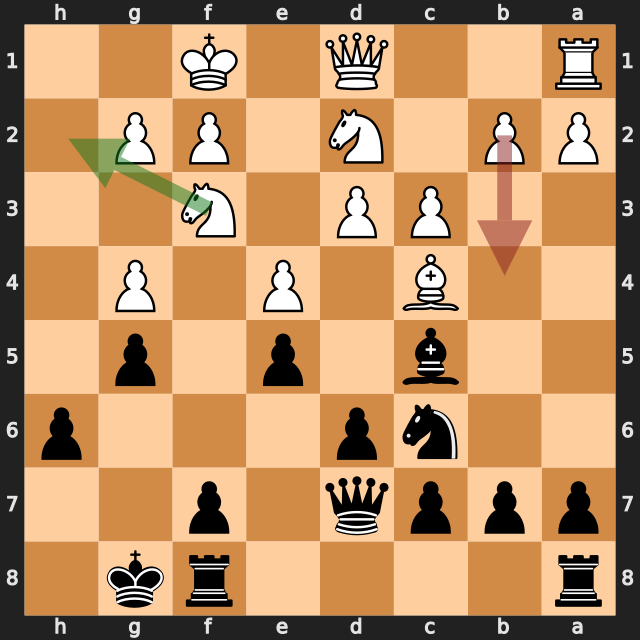
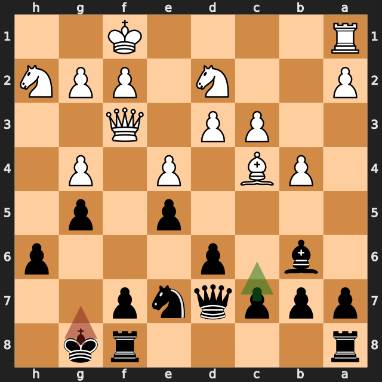
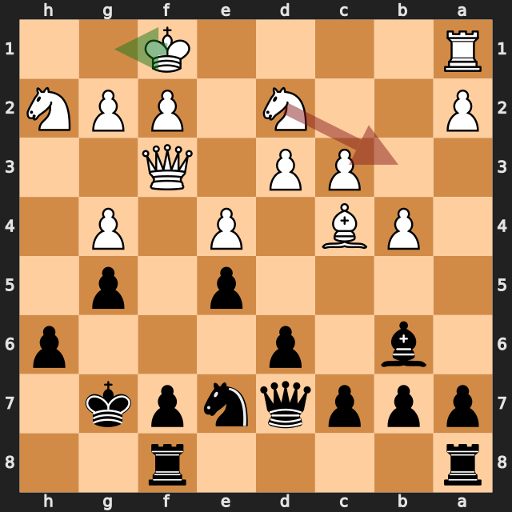

# Vyom Walia vs User

結果: 0-1 / 日付: 2026.09.19

これはStockfishの計算結果に基づく解説下書きです。候補の選定と戦術・戦略の説明はCodexで仕上げます。

評価値は常に白視点（＋は白有利）。メイトは数値評価と分けて表示します。

「期待スコア」はsf16モデルによる勝ち＋引き分けの半分の推定値で、人間の勝率ではありません。分類は暫定です。

## 注目局面 13.Kxf1

実戦は **Kxf1**。推奨候補は **Nxf1** です。

推奨候補の評価: +0.34 / 実戦手を選んだ場合: -1.24。

手番側の期待スコアの低下: 42.6ポイント。

第2候補との評価差が大きく、最善候補を見つけることが重要な局面です。唯一手かどうかは追加検証が必要です。

推奨手からの参考変化: Nxf1 → Bb6 → Ng3 → Ne7 → d4 → c6

実戦手からの参考変化: Kxf1 → Qf6

<!-- Codex: PVと盤面で裏付けられる狙い、相手の応手、改善点を説明する。未検証の戦術名や心理を創作しない。 -->

## 注目局面 13...Qd7

実戦は **Qd7**。推奨候補は **Qf6** です。

推奨候補の評価: -1.28 / 実戦手を選んだ場合: -1.07。

手番側の期待スコアの低下: 10.4ポイント。

推奨手からの参考変化: Qf6 → Qe2 → a5 → a4 → Qf4 → Ng1

実戦手からの参考変化: Qd7

<!-- Codex: PVと盤面で裏付けられる狙い、相手の応手、改善点を説明する。未検証の戦術名や心理を創作しない。 -->

## 注目局面 14.b4

実戦は **b4**。推奨候補は **Nh2** です。

推奨候補の評価: -1.06 / 実戦手を選んだ場合: -1.19。

手番側の期待スコアの低下: 7.3ポイント。

推奨手からの参考変化: Nh2 → Ne7 → Bb3 → a5 → a4 → c6

実戦手からの参考変化: b4 → Bb6

<!-- Codex: PVと盤面で裏付けられる狙い、相手の応手、改善点を説明する。未検証の戦術名や心理を創作しない。 -->

## 注目局面 16...Kg7

実戦は **Kg7**。推奨候補は **c6** です。

推奨候補の評価: -1.24 / 実戦手を選んだ場合: -0.88。

手番側の期待スコアの低下: 21.9ポイント。

推奨手からの参考変化: c6 → Kg1 → d5 → Bb3 → Rad8 → Rd1

実戦手からの参考変化: Kg7 → Kg1

<!-- Codex: PVと盤面で裏付けられる狙い、相手の応手、改善点を説明する。未検証の戦術名や心理を創作しない。 -->

## 注目局面 17.Nb3

実戦は **Nb3**。推奨候補は **Kg1** です。

推奨候補の評価: -0.79 / 実戦手を選んだ場合: -2.63。

手番側の期待スコアの低下: 36.5ポイント。

第2候補との評価差が大きく、最善候補を見つけることが重要な局面です。唯一手かどうかは追加検証が必要です。

推奨手からの参考変化: Kg1 → d5 → exd5 → f5 → Qe2 → Ng6

実戦手からの参考変化: Nb3 → c6 → Nd2 → d5 → Bb3 → f5

<!-- Codex: PVと盤面で裏付けられる狙い、相手の応手、改善点を説明する。未検証の戦術名や心理を創作しない。 -->
