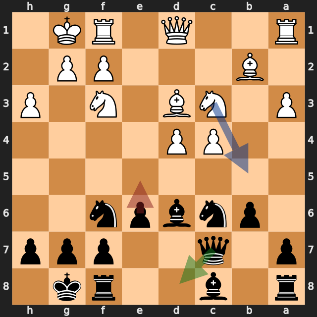
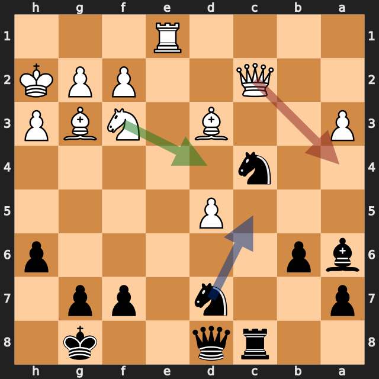
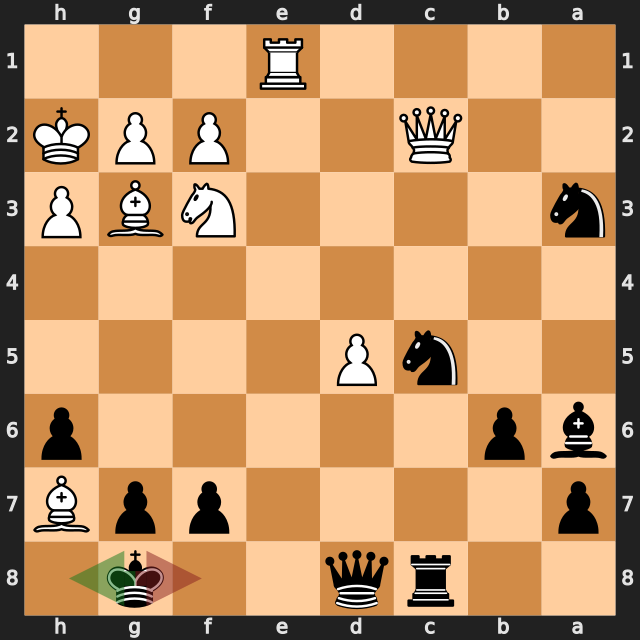
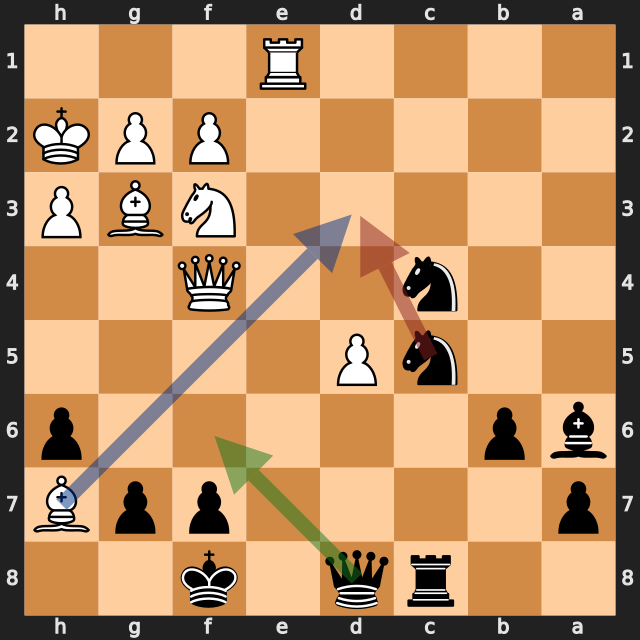

# つかんだ優勢を手放した一局——lichess、黒番の振り返り

[棋譜（PGN）](game.pgn) · [全局面の解析](game.analysis.json) · [重要局面の再確認](verification.analysis.json) · [lichessの対局ページ](https://lichess.org/pb65np0J)

2026年9月20日／lichess・レーティング戦（30分＋20秒）／白：Evgen1y57（1835）／黒：筆者（1694）／結果：1–0（29手で終局）

この対局は、黒が一度大きく不利になり、白のミスで優勢をつかみ、その優勢を2つの手で手放した一局です。**13...e5?** のあと、評価は白の +5 前後まで開きました。しかし白の **25.Qa4?** で黒が優勢になり、**25...Nc5!**、**26...Nxa3** と最善手を続けています。ところが **27...Kf8?** で優勢を返し、**29...Nd3?** で決定的に負けました。

以下の評価値はすべて白視点です。プラスが白有利、マイナスが黒（筆者）有利です。数値は今回の探索での目安で、確定的な勝率ではありません。局面図は黒側から見た向きです。赤は実戦手、緑は検討候補、青は次の狙い（1・2・5番目の図）を表します。

勝敗が動いた手を、最善候補との評価の差で並べます。

| 手 | 指した側 | 最善候補（評価） | 実戦（評価） | 差 |
|---|---|---|---|---|
| **13...e5** | 黒（筆者） | Qd8（+1.30） | e5（+6.87） | **約5.6** |
| 25.Qa4 | 白 | Nd4（+4.39） | Qa4（−1.07） | 約5.5 |
| **27...Kf8** | 黒（筆者） | Kh8（−1.12） | Kf8（+4.94） | **約6.1** |
| 29.Qf4 | 白 | Qd4（+3.91） | Qf4（+0.38） | 約3.5 |
| **29...Nd3** | 黒（筆者） | Qf6（+0.32） | Nd3（+7.96） | **約7.6** |

## 1. 大きく不利になった一手——13...e5?

序盤はインディアン・ディフェンスの形で、11手目までは、ほぼ互角でした。その前の **12...b6** も、最善候補の **12...Ne7**（約 +0.56）に対して約 **+1.53** で、約1.0悪化していました。

決定的だったのは **13...e5?** です。最善候補は **13...Qd8**（約 **+1.30**）で、実戦の **13...e5** は約 **+6.87** でした。

理由は **14.Nb5!** です。b5のナイトが、c7のクイーンとd6のビショップに同時に当たります（python-chessで確認）。**13...Qd8** は、クイーンをc7から外して、この両取りを避ける手です。

実戦の白は **14.d5** と指し、評価は約 **+4.16** に下がりました。最善の **14.Nb5**（約 +6.94）は見逃されており、黒には粘る余地が残りました。

**今回の学び：** ポーンで中央を突く前に、相手のナイトの跳び込み先を確認する。クイーンとビショップが、同じナイトの利きに入っていないかを見る。

## 2. 相手のミスを生かした——25.Qa4?に25...Nc5!

24手目のあと、最善候補は **25.Nd4**（約 **+4.39**）で、白が大きくリードしていました。実戦の **25.Qa4?** は約 **−1.07** で、約5.5も悪化し、黒が優勢に転じています。

黒の **25...Nc5!** は、a4のクイーンとd3のビショップに同時に当たる両取りです（python-chessで確認）。この手は、最善候補（約 −0.96）と一致しました。

続く **26.Qc2 Nxa3** も最善候補どおりで、黒がポーンを得ています（約 −1.25）。ここまでの黒は、相手のミスを的確に生かしました。

**今回の良かった点：** 相手のミスの直後に、両取りの手を見つけて、そのあとも最善手を続けました。

## 3. 優勢を返した一手——27...Kf8?

**26...Nxa3** のナイトは、白クイーン（c2）に当たっています。白は **27.Bh7+** とチェックを間に入れました。黒の合法手は **27...Kh8** と **27...Kf8** の2つだけです。

最善候補は **27...Kh8**（約 **−1.12**）です。白クイーンは、c2からh7のビショップを守っていますが、a3のナイトに追われて動かざるを得ません。すると **...Kxh7** でビショップを取れます。参考変化は **27...Kh8 28.Qb2 Kxh7 29.Qxa3** で、黒がビショップを取り、白がa3のナイトを取り返す形です。

実戦の **27...Kf8?** は約 **+4.94** で、約6.1も悪化しました。黒キングがh7に届かなくなり、ビショップを取る狙いが消えるからです。白クイーンは、ビショップを気にせず動けました。

**今回の学び：** チェックを受けたときは、2つの逃げ方の先を最後まで読む。キングの位置で、相手の駒に当たる狙いが変わる。

## 4. 2度目の機会と、決定的な一手——29.Qf4?と29...Nd3?

**28.Qd2 Nc4** で、c4のナイトがd2のクイーンに当たりました。白の最善候補は **29.Qd4**（約 **+3.91**）でしたが、実戦の **29.Qf4?** は約 **+0.38** で、白の優位がほぼ消えました。黒に2度目の機会が来ています。

ここでの最善候補は **29...Qf6**（約 **+0.32**）で、ほぼ互角を保てました。実戦の **29...Nd3?** は約 **+7.96** です。

**29...Nd3** は、f4のクイーンとe1のルークに同時に当たる、両取りに見える手です（python-chessで確認）。しかし、h7のビショップがd3を守っています。**Bxd3** と取られて、黒は駒を1つ失いました（駒の価値は黒の1ポイント有利から、白の2ポイント有利へ）。

**今回の学び：** 両取りは、その駒が取られないかを確認してから指す。相手の長い斜めの利き（今回はh7のビショップ）を見落とさない。

## 次の対局で意識したいこと

- **ポーンを突く前に、相手のナイトの跳び込み先を確認する。** 13...e5?は、Nb5の両取りが原因でした。
- **チェックを受けたら、逃げ方を2つとも最後まで読む。** 27...Kf8?で、Kxh7の狙いが消えました。
- **両取りは、取られないかを確認する。** 29...Nd3?は、h7のビショップに取られました。

---

解析：Stockfish 19、1スレッド、Hash 128MB。全局面0.3秒、候補12局面を各2秒・MultiPV 3で解析しました。記事で扱った局面（12...b6、13...e5、14.d5、25.Qa4、25...Nc5、26.Qc2、26...Nxa3、27.Bh7+、27...Kf8、29.Qf4、29...Nd3）は、各6秒・MultiPV 4で再確認しています。評価値は本文で明示した探索の値であり、確定的な勝率ではありません。

自動選定の重要局面（6局面：3.e3、12...b6、25.Qa4、27...Kf8、29.Qf4、29...Nd3）のうち、3.e3は差が小さいため扱っていません。一方、勝敗を分けた13...e5は、詳細解析の対象でしたが、重要局面には入りませんでした。0.3秒の軽量解析は、この対局のように戦術が多い局面では評価が大きく揺れます（13...e5の直後は+6.83、次の手で+3.35）。このため、追加解析（6秒）で確認しています。`verification.analysis.json` には、11...dxc4、22.Qc2、24...Nxc4、28.Qd2も含まれますが、差が小さい、または本文の主題から外れるため、扱っていません。

このPGNにはlichessの評価コメントが付いておらず、数値はすべて本ツールのStockfishで計算しています。
