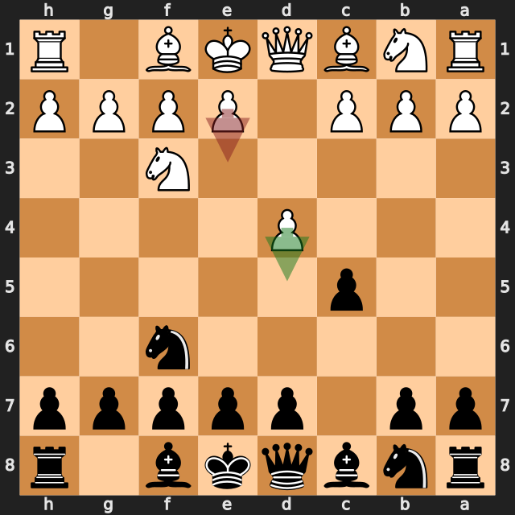
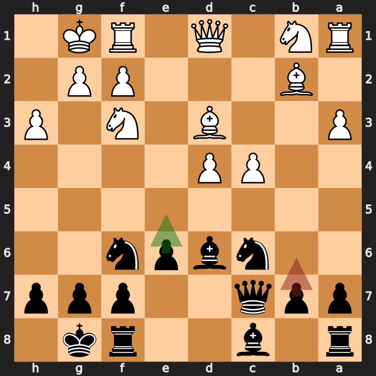
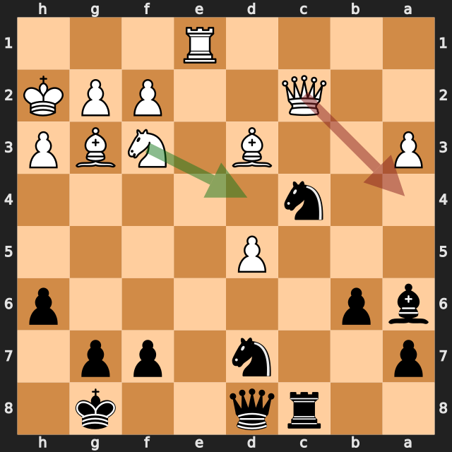
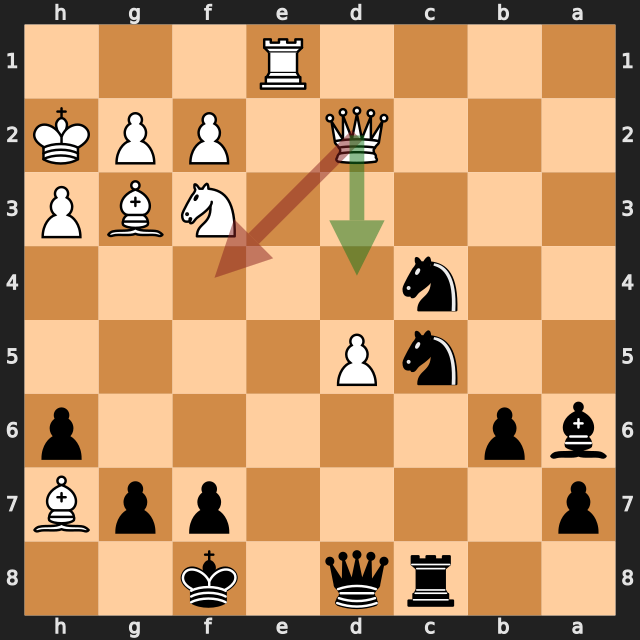
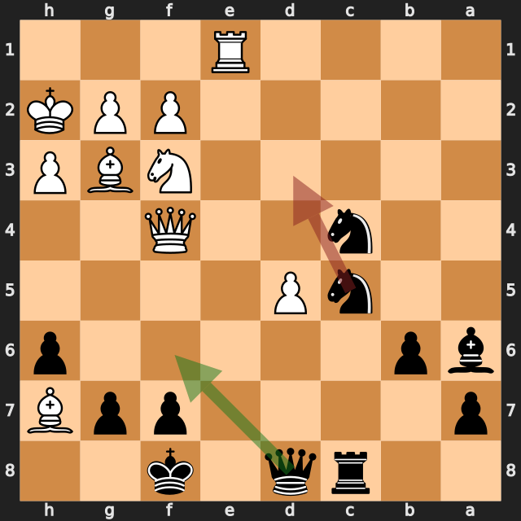

# Evgen1y57 vs zbxah

結果: 1-0 / 日付: 2026.09.20

これはStockfishの計算結果に基づく解説下書きです。候補の選定と戦術・戦略の説明はAIアシスタントで仕上げます。

評価値は常に白視点（＋は白有利）。メイトは数値評価と分けて表示します。

「期待スコア」はsf16モデルによる勝ち＋引き分けの半分の推定値で、人間の勝率ではありません。分類は暫定です。

## 注目局面 3.e3

実戦は **e3**。推奨候補は **d5** です。

推奨候補の評価: +0.55 / 実戦手を選んだ場合: +0.19。

手番側の期待スコアの低下: 4.9ポイント。

推奨手からの参考変化: d5 → b5 → Bg5 → g6 → d6 → exd6

実戦手からの参考変化: e3 → d5 → c4 → e6 → cxd5 → exd5

<!-- AIアシスタント: PVと盤面で裏付けられる狙い、相手の応手、改善点を説明する。未検証の戦術名や心理を創作しない。 -->

## 注目局面 12...b6

実戦は **b6**。推奨候補は **e5** です。

推奨候補の評価: +0.66 / 実戦手を選んだ場合: +1.41。

手番側の期待スコアの低下: 38.0ポイント。

推奨手からの参考変化: e5 → c5 → e4 → cxd6 → Qxd6 → Bxe4

実戦手からの参考変化: b6 → Nc3 → Qd8 → Ne4 → Nxe4 → Bxe4

<!-- AIアシスタント: PVと盤面で裏付けられる狙い、相手の応手、改善点を説明する。未検証の戦術名や心理を創作しない。 -->

## 注目局面 25.Qa4

実戦は **Qa4**。推奨候補は **Nd4** です。

推奨候補の評価: +4.54 / 実戦手を選んだ場合: -0.99。

手番側の期待スコアの低下: 75.3ポイント。

推奨手からの参考変化: Nd4 → Nde5 → Bf5 → Rc5 → Qe4 → g6

実戦手からの参考変化: Qa4 → Nc5

<!-- AIアシスタント: PVと盤面で裏付けられる狙い、相手の応手、改善点を説明する。未検証の戦術名や心理を創作しない。 -->

## 注目局面 27...Kf8

実戦は **Kf8**。推奨候補は **Kh8** です。

推奨候補の評価: -0.94 / 実戦手を選んだ場合: +4.10。

手番側の期待スコアの低下: 71.5ポイント。

第2候補との評価差が大きく、最善候補を見つけることが重要な局面です。唯一手かどうかは追加検証が必要です。

推奨手からの参考変化: Kh8 → Qa2 → Kxh7 → Qxa3 → Qxd5 → Re7

実戦手からの参考変化: Kf8 → Qd1

<!-- AIアシスタント: PVと盤面で裏付けられる狙い、相手の応手、改善点を説明する。未検証の戦術名や心理を創作しない。 -->

## 注目局面 29.Qf4

実戦は **Qf4**。推奨候補は **Qd4** です。

推奨候補の評価: +4.07 / 実戦手を選んだ場合: +0.31。

手番側の期待スコアの低下: 48.9ポイント。

推奨手からの参考変化: Qd4 → Qf6 → Bh4 → Qxd4 → Be7+ → Ke8

実戦手からの参考変化: Qf4 → Qf6

<!-- AIアシスタント: PVと盤面で裏付けられる狙い、相手の応手、改善点を説明する。未検証の戦術名や心理を創作しない。 -->

## 注目局面 29...Nd3

実戦は **Nd3**。推奨候補は **Qf6** です。

推奨候補の評価: +0.46 / 実戦手を選んだ場合: +7.58。

手番側の期待スコアの低下: 47.5ポイント。

第2候補との評価差が大きく、最善候補を見つけることが重要な局面です。唯一手かどうかは追加検証が必要です。

推奨手からの参考変化: Qf6 → Qc1 → Re8 → Rxe8+ → Kxe8 → Bb1

実戦手からの参考変化: Nd3 → Bxd3 → Qxd5 → Ne5 → Nxe5 → Bxa6

<!-- AIアシスタント: PVと盤面で裏付けられる狙い、相手の応手、改善点を説明する。未検証の戦術名や心理を創作しない。 -->
