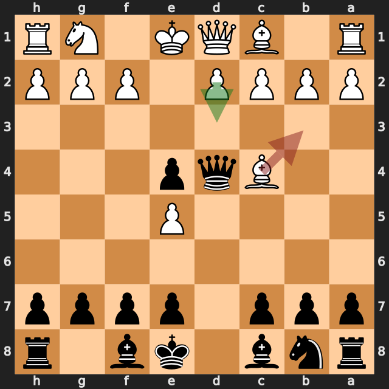
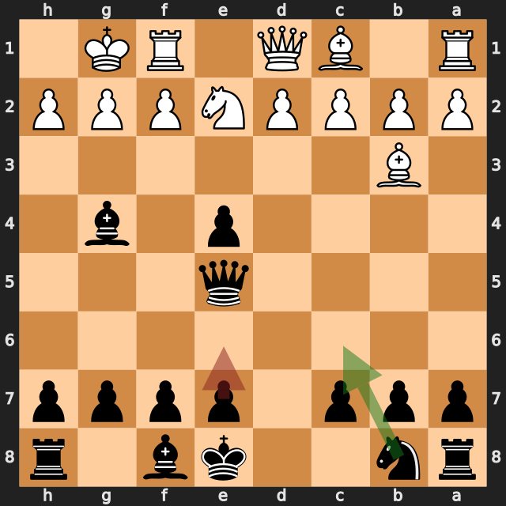
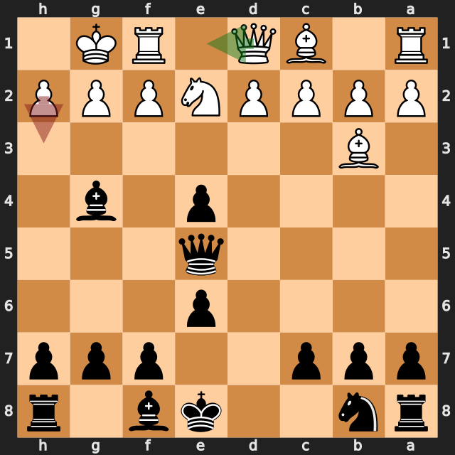
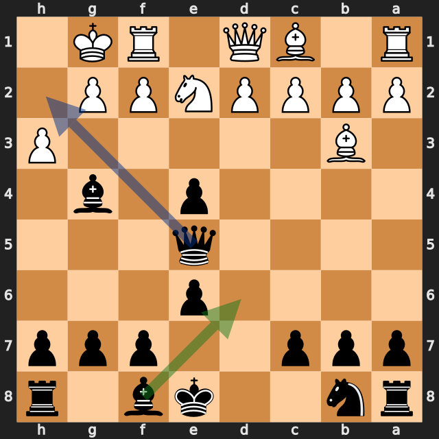
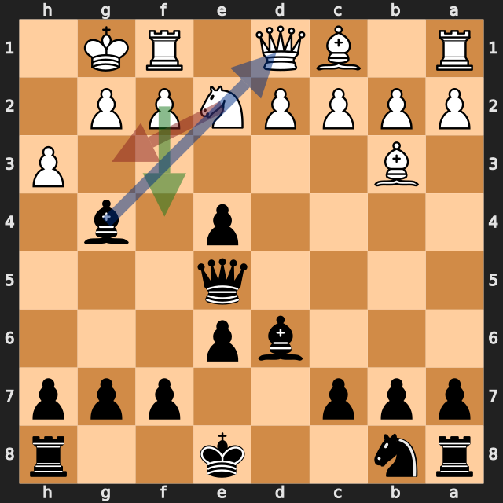

# 9...Bd6!で白のクイーンを奪った10手の一局——lichess、黒番の振り返り

[棋譜（PGN）](game.pgn) · [全局面の解析](game.analysis.json) · [重要局面の再確認](verification.analysis.json) · [lichessの対局ページ](https://lichess.org/TK7MBc9G)

2026年9月20日／lichess・レーティング戦（30分＋0秒）／白：Hamidsadr2（1723）／黒：筆者（1690）／結果：0–1（10手で終局）

この対局は、黒が序盤でポーンを得て、白の **9.h3?** で決まった一局です。黒の **9...Bd6!** は最善手で、**10.Ng3 Bxd1** でクイーンを取りました。一方で、その前の **7...Bg4** と **8...e6** には小さな緩みがあり、白には **9.Qe1** という助かる道が残っていました。

以下の評価値はすべて白視点です。マイナスが黒（筆者）有利です。数値は今回の探索での目安で、確定的な勝率ではありません。局面図は黒側から見た向きです。赤は実戦手、緑は検討候補で、実戦手が最善のときは緑だけを表示します。青は次の狙い（4・5番目の図）です。

勝敗に関わった手を、最善候補との評価の差で並べます。

| 手 | 指した側 | 最善候補（評価） | 実戦（評価） | 差 |
|---|---|---|---|---|
| 6.Bb3 | 白 | d3（−0.18） | Bb3（−1.52） | 約1.3 |
| 7...Bg4 | 黒（筆者） | Nc6（−1.68） | Bg4（−0.99） | 約0.7 |
| 8...e6 | 黒（筆者） | Nc6（−1.29） | e6（−0.29） | 約1.0 |
| **9.h3** | 白 | Qe1（−0.55） | h3（−7.96） | **約7.4** |
| 9...Bd6 | 黒（筆者） | Bd6（−7.54） | Bd6（−7.54） | 最善 |

## 1. 序盤でポーンを得た——5...Qd4!と6...Qxe5

序盤は **1...Nf6** のアレヒン・ディフェンスの形で、**3...Ne4 4.Nxe4 dxe4 5.Bc4** と進みました。

黒の **5...Qd4!** は、最善候補と一致しました（約 −0.18）。d4のクイーンは、c4のビショップとe5のポーンの両方に当たっていて、白にはどちらの守りもありません（python-chessで確認）。

白の **6.Bb3?** は、ビショップを逃がす手でした。しかし、e5のポーンを失い、**6...Qxe5**（最善と一致、約 −1.39）で、黒がポーンを得ています。最善候補の **6.d3**（約 −0.18）なら、c4のビショップを守りながら、e4のポーンに当てられました。実戦の **6.Bb3** は約 **−1.52** で、約1.3悪化しています。

**今回の良かった点：** 相手の駒が2つ同時に無防備な局面で、クイーンで両方に当たる手を見つけました。

## 2. 小さな緩み——7...Bg4と8...e6

**7...Bg4** は、e2のナイトを釘付けにする手です。ナイトが動くと、g4のビショップの利きがd1のクイーンに通ります（python-chessで確認）。ただし、最善候補は **7...Nc6**（約 −1.68）で、実戦の **7...Bg4** は約 −0.99、約0.7の差がありました。

続く **8...e6** も、最善候補の **8...Nc6**（約 −1.29）に対して約 **−0.29** で、約1.0低い手です。**8...e6** のあとの局面では、白に **9.Qe1**（約 −0.55）という、黒の優位をほぼ消せる手が残っていました。

**今回の学び：** 優勢な局面でも、最善候補との差を確認する。今回は差が約1.0で、白に立て直しの手が残りました。

## 3. 決定的な場面——9.h3?、9...Bd6!、10.Ng3?

白の **9.h3?** は、g4のビショップに当てる自然な手でした。最善候補は **9.Qe1**（約 **−0.55**）で、実戦の **9.h3** は約 **−7.96**、約7.4も悪化しています。

理由は、h3でh2のマスが空いたことです。**9...Bd6!**（最善、約 **−7.54**）で、黒は取られそうなg4のビショップを動かさず、e5のクイーンとd6のビショップで、h2に狙いをつけました。白が何もしなければ、**...Qh2#** でチェックメイトです（python-chessで確認）。g4のビショップを **10.hxg4** と取っても、**10...Qh2#** でチェックメイトになります（python-chessで確認）。

実戦の **10.Ng3** は、g3のナイトでe5–h2の斜めをふさぎ、詰みを防ぎました。しかし、e2のナイトが動いたことで、g4のビショップの利きがd1のクイーンに通り、**10...Bxd1** でクイーンを取られました。

最善候補の **10.f4**（約 −7.54）でも、参考変化は **10.f4 exf3 11.Rxf3 Bxf3 12.gxf3 Qh2+** と、黒が優勢です。**10.Ng3** は約 −8.57 で約1.0低い手ですが、勝敗はすでに **9.h3?** で決まっていました。

**今回の良かった点：** 取られそうな駒を動かさず、詰みの狙いを作る最善手 **9...Bd6!** を見つけました。**7...Bg4** のピンも、最後の **10...Bxd1** につながっています。

## 次の対局で意識したいこと

- **相手の駒が2つ同時に無防備なら、クイーンで両方に当たる手を探す。** 5...Qd4!が例です。
- **相手がキングの前のポーンを動かしたら、空いたマスへの狙いを確認する。** 9.h3?で空いたh2が、詰みの狙いになりました。
- **優勢でも、最善候補との差を確認する。** 8...e6は、白に9.Qe1の道を残しました。

---

解析：Stockfish 19、1スレッド、Hash 128MB。全局面0.3秒、候補12局面を各2秒・MultiPV 3で解析しました。記事で扱った局面（5...Qd4、6.Bb3、6...Qxe5、7...Bg4、8...e6、9.h3、9...Bd6、10.Ng3）は、各6秒・MultiPV 4で再確認しています。評価値は本文で明示した探索の値であり、確定的な勝率ではありません。

自動選定の重要局面（6局面：3...Ne4、4.Nxe4、6.Bb3、7...Bg4、8...e6、9.h3）は、損失の大きい手を選ぶ仕組みなので、最善手の9...Bd6は入りません。`verification.analysis.json` には、3...Ne4、4.Nxe4、5.Bc4、7.Ne2、8.O-Oも含まれますが、差が小さい、または本文の主題から外れるため、扱っていません。

このPGNにはlichessの評価コメントが付いておらず、数値はすべて本ツールのStockfishで計算しています。
