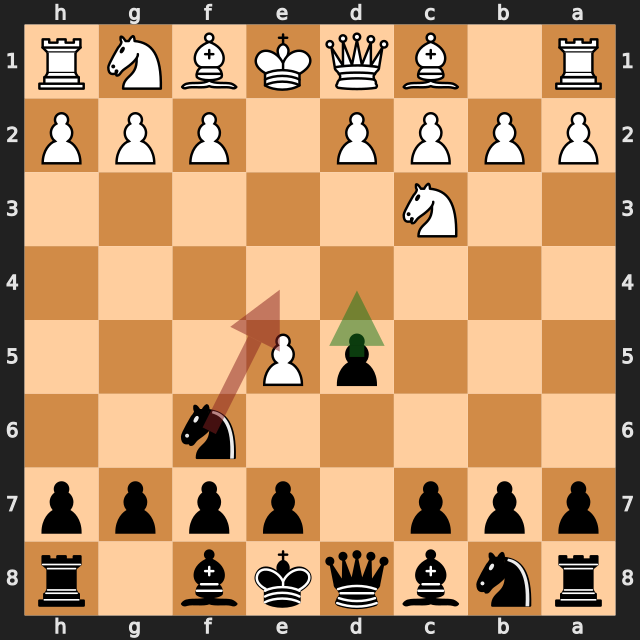
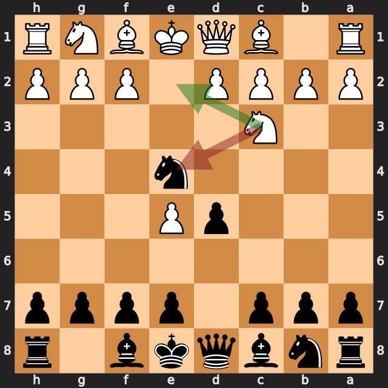
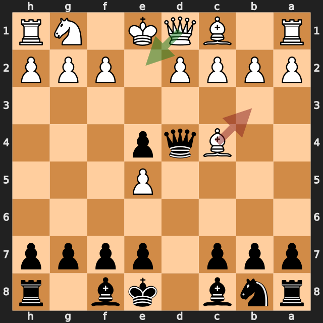
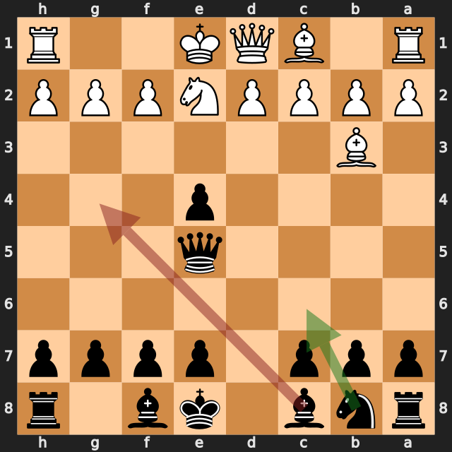

# Hamidsadr2 vs zbxah

結果: 0-1 / 日付: 2026.09.20

これはStockfishの計算結果に基づく解説下書きです。候補の選定と戦術・戦略の説明はAIアシスタントで仕上げます。

評価値は常に白視点（＋は白有利）。メイトは数値評価と分けて表示します。

「期待スコア」はsf16モデルによる勝ち＋引き分けの半分の推定値で、人間の勝率ではありません。分類は暫定です。

## 注目局面 3...Ne4

実戦は **Ne4**。推奨候補は **d4** です。

推奨候補の評価: +0.31 / 実戦手を選んだ場合: +0.83。

手番側の期待スコアの低下: 16.1ポイント。

推奨手からの参考変化: d4 → exf6 → dxc3 → fxg7 → cxd2+ → Qxd2

実戦手からの参考変化: Ne4

<!-- AIアシスタント: PVと盤面で裏付けられる狙い、相手の応手、改善点を説明する。未検証の戦術名や心理を創作しない。 -->

## 注目局面 4.Nxe4

実戦は **Nxe4**。推奨候補は **Nce2** です。

推奨候補の評価: +0.97 / 実戦手を選んだ場合: +0.38。

手番側の期待スコアの低下: 24.3ポイント。

第2候補との評価差が大きく、最善候補を見つけることが重要な局面です。唯一手かどうかは追加検証が必要です。

推奨手からの参考変化: Nce2 → f6 → d3 → Ng5 → Bxg5 → fxg5

実戦手からの参考変化: Nxe4 → dxe4 → d4 → exd3 → Bxd3 → Nc6

<!-- AIアシスタント: PVと盤面で裏付けられる狙い、相手の応手、改善点を説明する。未検証の戦術名や心理を創作しない。 -->

## 注目局面 6.Bb3

実戦は **Bb3**。推奨候補は **Qe2** です。

推奨候補の評価: -0.01 / 実戦手を選んだ場合: -1.42。

手番側の期待スコアの低下: 46.2ポイント。

推奨手からの参考変化: Qe2 → Qxe5 → d3 → Bf5 → g4 → Be6

実戦手からの参考変化: Bb3 → Qxe5 → Ne2 → Nc6 → d3 → exd3

<!-- AIアシスタント: PVと盤面で裏付けられる狙い、相手の応手、改善点を説明する。未検証の戦術名や心理を創作しない。 -->

## 注目局面 7...Bg4

実戦は **Bg4**。推奨候補は **Nc6** です。

推奨候補の評価: -1.41 / 実戦手を選んだ場合: -1.06。

手番側の期待スコアの低下: 14.0ポイント。

推奨手からの参考変化: Nc6 → O-O → Bg4 → c3 → O-O-O → Qe1

実戦手からの参考変化: Bg4 → h3 → Bh5 → d4 → exd3 → Qxd3

<!-- AIアシスタント: PVと盤面で裏付けられる狙い、相手の応手、改善点を説明する。未検証の戦術名や心理を創作しない。 -->

## 注目局面 8...e6

実戦は **e6**。推奨候補は **Nc6** です。

推奨候補の評価: -1.36 / 実戦手を選んだ場合: -0.41。

手番側の期待スコアの低下: 42.5ポイント。

第2候補との評価差が大きく、最善候補を見つけることが重要な局面です。唯一手かどうかは追加検証が必要です。

推奨手からの参考変化: Nc6 → c3 → O-O-O → Qe1 → Bd7 → f3

実戦手からの参考変化: e6 → Qe1

<!-- AIアシスタント: PVと盤面で裏付けられる狙い、相手の応手、改善点を説明する。未検証の戦術名や心理を創作しない。 -->

## 注目局面 9.h3

実戦は **h3**。推奨候補は **Qe1** です。

推奨候補の評価: -0.51 / 実戦手を選んだ場合: -7.63。

手番側の期待スコアの低下: 45.9ポイント。

第2候補との評価差が大きく、最善候補を見つけることが重要な局面です。唯一手かどうかは追加検証が必要です。

推奨手からの参考変化: Qe1 → Bxe2

実戦手からの参考変化: h3 → Bd6 → f4 → exf3 → Rxf3 → Bxf3

<!-- AIアシスタント: PVと盤面で裏付けられる狙い、相手の応手、改善点を説明する。未検証の戦術名や心理を創作しない。 -->
