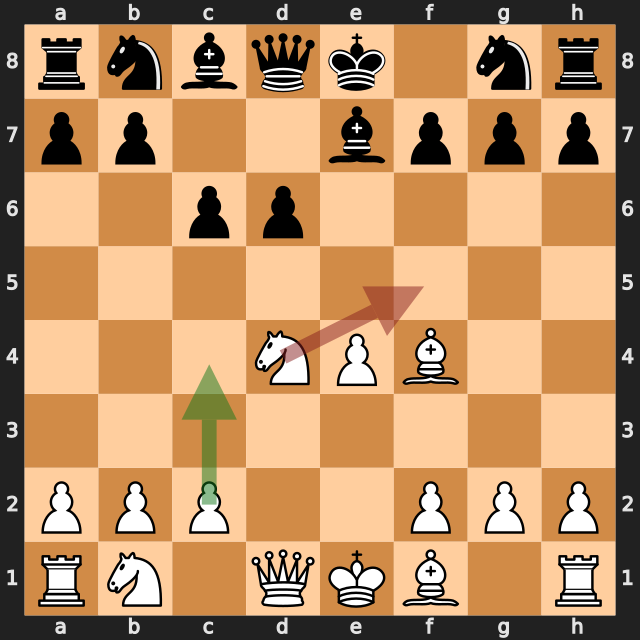
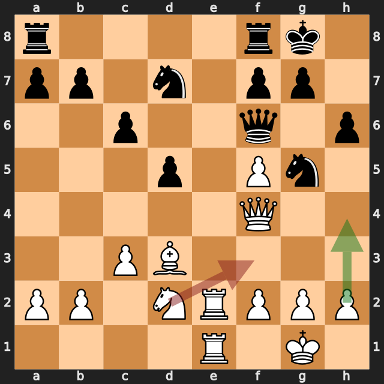
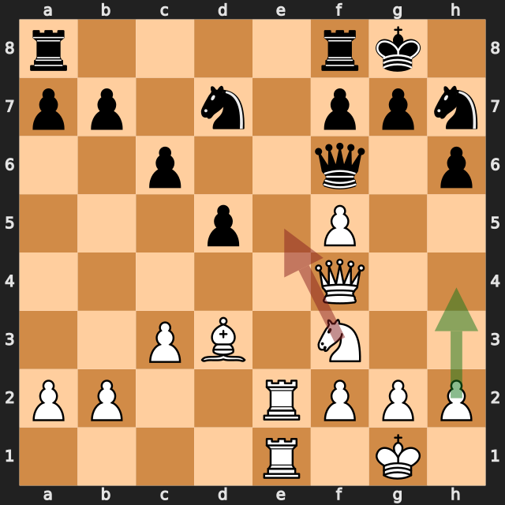
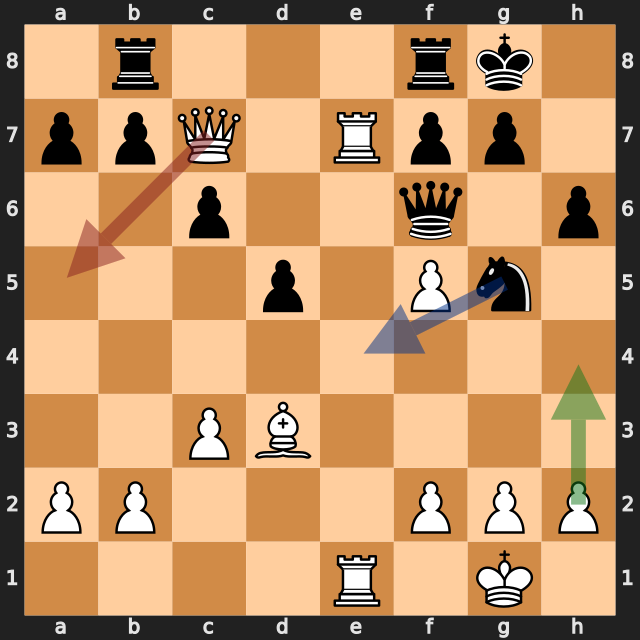
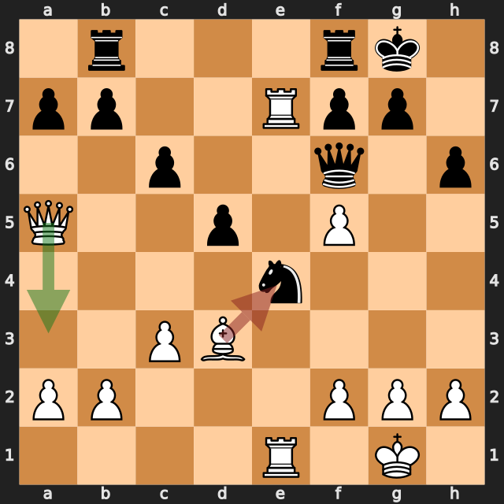

# 3度のリードを手放した一局——lichess、白番の振り返り

[棋譜（PGN）](game.pgn) · [全局面の解析](game.analysis.json) · [重要局面の再確認](verification.analysis.json) · [lichessの対局ページ](https://lichess.org/ybwSfKfJ)

2026年9月20日／lichess・レーティング戦（30分＋20秒）／白：筆者（1703）／黒：Mohammed1972（1571）／結果：0–1（24手で終局）

この対局は、序盤から中盤の駒組みをほぼ互角で進め、黒が3回ミスをした直後に、白が毎回リードを手放した一局です。しかも、その3回とも、最善候補は **h4** でした。最後は **23.Qa5?** で、e7のルークの守りを外してしまいました。

以下の評価値はすべて白視点で、プラスが白有利です。数値は今回の探索での目安で、確定的な勝率ではありません。局面図は白側から見た向きです。赤は実戦手、緑は検討候補、青は次の狙い（4番目の図のみ）を表します。

白の手ごとに、最善候補との評価の差を並べると、リードがどこで消えたかが分かります。

| 白の手 | 最善候補（評価） | 実戦（評価） | 差 |
|---|---|---|---|
| 6.Nf5 | c4（+0.85） | Nf5（−0.11） | 約1.0 |
| 17.Nf3 | h4（+1.18） | Nf3（+0.01） | 約1.2 |
| 18.Ne5 | h4（+1.63） | Ne5（−0.09） | 約1.7 |
| **23.Qa5** | h4（+1.84） | Qa5（−1.87） | **約3.7** |
| **24.Bxe4** | Qa3（−1.94） | Bxe4（−6.32） | **約4.4** |

## 1. 序盤の小さな分岐——6.Nf5

序盤は **2...d6** のフィリドール・ディフェンスで、**3.d4 exd4 4.Nxd4** と進みました。**6.Nf5** の前は、約 **+0.85** で白がやや有利です。最善候補は **6.c4**、ほかに **6.Nc3** や **6.Qd2** も同じ評価（約 +0.85）で、差はほとんどありません。

実戦の **6.Nf5** は約 **−0.11** で、ほぼ互角に戻りました。この探索で挙がった手順は、**6.Nf5 Bxf5 7.exf5 Qa5+ 8.Nc3 Qxf5** です。**7...Qa5+** はチェックで、続けてf5のポーンを取られます（python-chessで確認）。実戦の黒は **7...Nf6** で、この手は指しませんでした。

**今回の学び：** 駒を交換してポーンをf5へ出す形は、そのポーンが守りにくくなる。交換に入る前に、チェックを絡めてそのポーンを狙う手がないかを確認する。

## 2. 黒のミス直後に、h4を2度逃す——17.Nf3と18.Ne5

**16...Ng5?** は黒のミスでした。最善候補の **16...Qd8** は約 +0.30、実戦は約 **+1.14** で、白が約0.8有利になっています。

ここでの最善候補は **17.h4** で、約 **+1.18** です。ポーンのh4が、g5のナイトに当たります。g5のナイトはf6のクイーンとh6のポーンに守られていますが、ポーンに攻撃された駒は、守られていても動く必要があります。

実戦の **17.Nf3** は約 **+0.01** で、優位が消えました。

続く **17...Nh7?** も黒のミスです（最善は **17...Nxf3+**、約 +0.02。実戦は約 **+1.61**）。

ここでも最善候補は **18.h4**（約 **+1.63**）でした。h4のポーンがg5のマスを押さえ、h7のナイトがg5へ戻りにくくなります（python-chessで確認）。実戦の **18.Ne5** は約 **−0.09** で、**18...Nxe5 19.Qxe5** と駒の交換に進んで優位が消えました。

**今回の学び：** 相手のミスの直後は、すでに評価が上がった局面。すぐ駒の交換に進まず、優位を保つ手を探す。この対局では、ポーンで相手のナイトを追う **h4** が、2度とも最善候補でした。

## 3. 決定的な場面——23.Qa5?と24.Bxe4?

**22.Re7** は、最善候補と同じ約 **+0.37** で、7段目にルークを進めた判断は良いものでした。ここで黒が **22...Ng5?** と指しました（最善は **22...Qg5**、約 +0.41。実戦は約 **+1.84**）。

3度目のチャンスです。最善候補は **23.h4**（約 **+1.84**）でした。参考変化は **23.h4 Ne4 24.Bxe4 dxe4 25.R1xe4** で、白がポーンを得ます（python-chessで確認）。

実戦の **23.Qa5?** は、約 **−1.87** で、約3.7も悪化しました。理由は、e7のルークを守っていた駒が、この一手で外れるからです。

- 23.Qa5の前は、e7のルークを **クイーン（c7）** と **e1のルーク** の2枚が守っています。
- **23.Qa5 Ne4!** で、クイーンがc7を離れ、e1のルークの利きも、e4のナイトでふさがれます。
- 守りが0枚になり、f6のクイーンがe7のルークを取れます（python-chessで確認）。

続く **24.Bxe4?** は約 **−6.32** です。最善候補は **24.Qa3**（約 **−1.94**）で、それでも黒が優勢ですが、差は約2にとどまります。実戦の **24.Bxe4 Qxe7** では、白はルークを失い、e4のビショップもd5のポーンに狙われます。

**今回の学び：** 駒を動かす前に、その駒が何を守っているかを確認する。1手で守りが外れないかを見てから指す。

## 次の対局で意識したいこと

- **相手のミスの直後は、優位を保つ手を探す。** 3回とも、最善候補は **h4** で、ポーンで相手のナイトを追う手でした。
- **駒を動かす前に、その駒が守っているものを確認する。** 23.Qa5?でルークが孤立しました。
- **駒の交換に入る前に、形の変化を確認する。** 6.Nf5でf5のポーンが狙われ、18.Ne5で優位が消えました。

---

解析：Stockfish 19、1スレッド、Hash 128MB。全局面0.3秒、候補12局面を各2秒・MultiPV 3で解析しました。記事で扱った局面（6.Nf5、16...Ng5、17.Nf3、17...Nh7、18.Ne5、22...Ng5、23.Qa5、24.Bxe4）と22.Re7は、各6秒・MultiPV 4で再確認しています。評価値は本文で明示した探索の値であり、確定的な勝率ではありません。

自動選定の重要局面（6局面）には、6.Nf5・22.Re7・24.Bxe4が入りませんでした。このため、追加解析で確認しています。`verification.analysis.json` には21.Re3も含まれますが、差が約0.26と小さいため本文では扱っていません。

このPGNにはlichessの評価コメントが付いておらず、数値はすべて本ツールのStockfishで計算しています。
