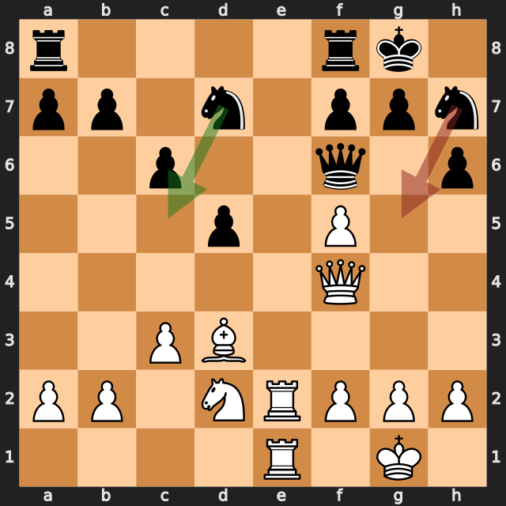
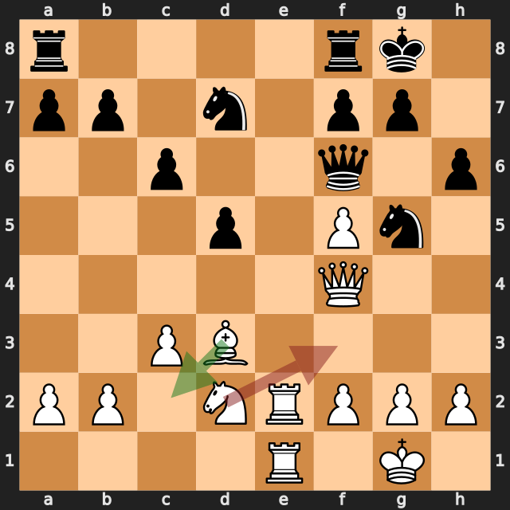
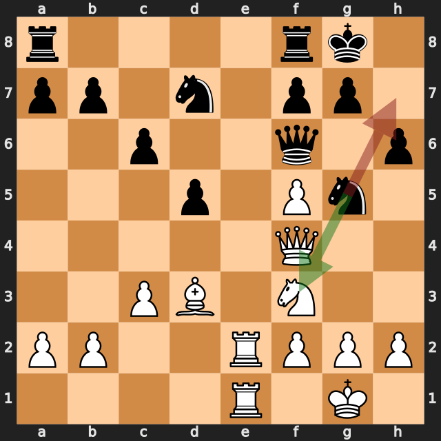
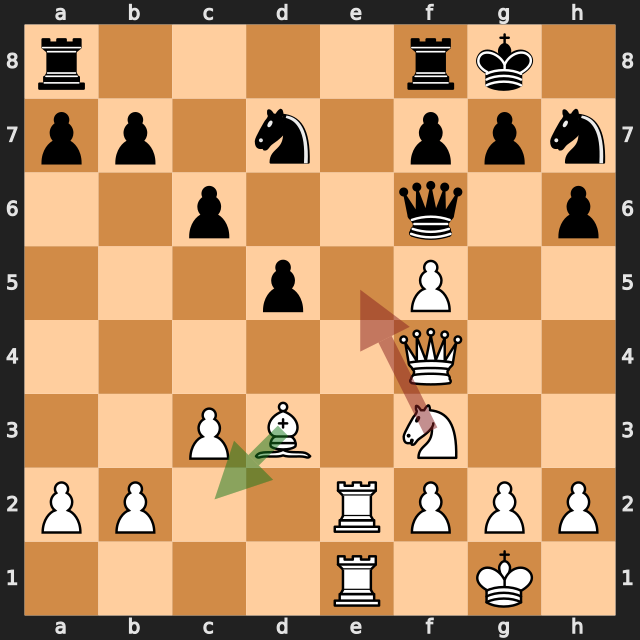
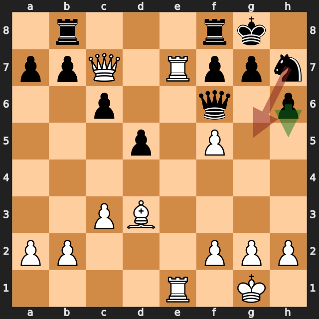
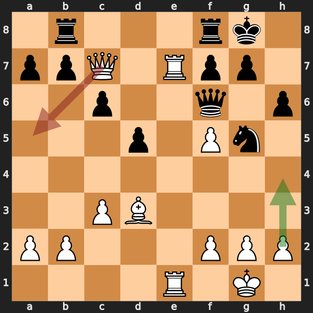

# zbxah vs Mohammed1972

結果: 0-1 / 日付: 2026.09.20

これはStockfishの計算結果に基づく解説下書きです。候補の選定と戦術・戦略の説明はAIアシスタントで仕上げます。

評価値は常に白視点（＋は白有利）。メイトは数値評価と分けて表示します。

「期待スコア」はsf16モデルによる勝ち＋引き分けの半分の推定値で、人間の勝率ではありません。分類は暫定です。

## 注目局面 16...Ng5

実戦は **Ng5**。推奨候補は **Nc5** です。

推奨候補の評価: +0.33 / 実戦手を選んだ場合: +1.10。

手番側の期待スコアの低下: 32.3ポイント。

推奨手からの参考変化: Nc5 → Bc2

実戦手からの参考変化: Ng5 → Bc2

<!-- AIアシスタント: PVと盤面で裏付けられる狙い、相手の応手、改善点を説明する。未検証の戦術名や心理を創作しない。 -->

## 注目局面 17.Nf3

実戦は **Nf3**。推奨候補は **Bc2** です。

推奨候補の評価: +1.21 / 実戦手を選んだ場合: +0.03。

手番側の期待スコアの低下: 39.4ポイント。

第2候補との評価差が大きく、最善候補を見つけることが重要な局面です。唯一手かどうかは追加検証が必要です。

推奨手からの参考変化: Bc2 → Ne6 → Qg3 → Nec5 → b4 → Na6

実戦手からの参考変化: Nf3 → Nxf3+

<!-- AIアシスタント: PVと盤面で裏付けられる狙い、相手の応手、改善点を説明する。未検証の戦術名や心理を創作しない。 -->

## 注目局面 17...Nh7

実戦は **Nh7**。推奨候補は **Nxf3+** です。

推奨候補の評価: +0.06 / 実戦手を選んだ場合: +1.50。

手番側の期待スコアの低下: 47.3ポイント。

推奨手からの参考変化: Nxf3+ → Qxf3 → a5 → g3 → a4 → Bc2

実戦手からの参考変化: Nh7 → h4 → Rad8 → Bc2 → a5 → g4

<!-- AIアシスタント: PVと盤面で裏付けられる狙い、相手の応手、改善点を説明する。未検証の戦術名や心理を創作しない。 -->

## 注目局面 18.Ne5

実戦は **Ne5**。推奨候補は **Bc2** です。

推奨候補の評価: +1.48 / 実戦手を選んだ場合: -0.04。

手番側の期待スコアの低下: 47.2ポイント。

推奨手からの参考変化: Bc2 → Ng5

実戦手からの参考変化: Ne5 → Nxe5

<!-- AIアシスタント: PVと盤面で裏付けられる狙い、相手の応手、改善点を説明する。未検証の戦術名や心理を創作しない。 -->

## 注目局面 22...Ng5

実戦は **Ng5**。推奨候補は **h5** です。

推奨候補の評価: +0.37 / 実戦手を選んだ場合: +1.70。

手番側の期待スコアの低下: 47.5ポイント。

推奨手からの参考変化: h5 → h4 → Qh6 → R7e2 → Qf6 → Qf4

実戦手からの参考変化: Ng5 → h4 → Ne4 → Bxe4 → dxe4 → R1xe4

<!-- AIアシスタント: PVと盤面で裏付けられる狙い、相手の応手、改善点を説明する。未検証の戦術名や心理を創作しない。 -->

## 注目局面 23.Qa5

実戦は **Qa5**。推奨候補は **h4** です。

推奨候補の評価: +1.85 / 実戦手を選んだ場合: -1.93。

手番側の期待スコアの低下: 99.4ポイント。

第2候補との評価差が大きく、最善候補を見つけることが重要な局面です。唯一手かどうかは追加検証が必要です。

推奨手からの参考変化: h4 → Ne4 → Bxe4 → dxe4 → R1xe4 → Qxf5

実戦手からの参考変化: Qa5 → Ne4 → Qa3 → c5 → Rc7 → Qd8

<!-- AIアシスタント: PVと盤面で裏付けられる狙い、相手の応手、改善点を説明する。未検証の戦術名や心理を創作しない。 -->
