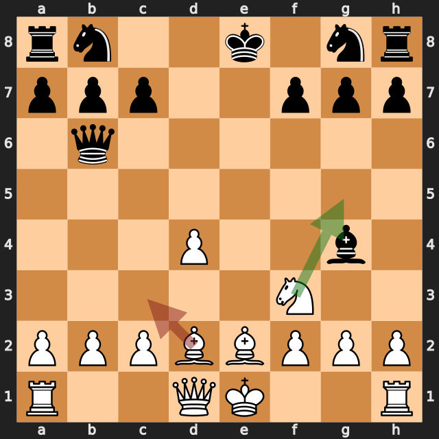
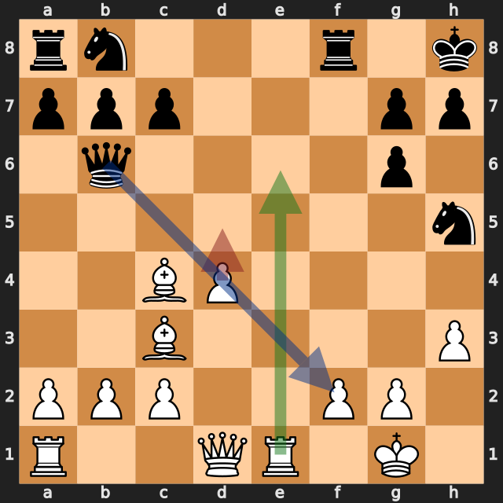
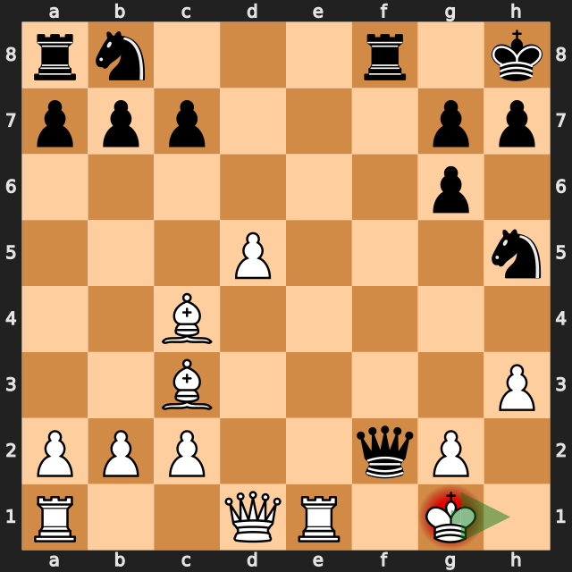

# 勝勢から投了まで2手——lichess、白番の振り返り

[棋譜（PGN）](game.pgn) · [全局面の解析](game.analysis.json) · [重要局面の再確認](verification.analysis.json) · [投了局面の解析](final-position.analysis.json) · [lichessの対局ページ](https://lichess.org/yfMNUiVy)

2026年9月25日／lichess・レーティング戦（30分＋0秒）／白：筆者（1698）／黒：jawher5241（1701）／結果：0–1（18手で白の投了）

黒は **1.e4 d5 2.exd5 e6** とポーンを捨てるスカンジナビアン・ディフェンスのベーンケ・ギャンビットを選びました。その後の黒の **4...Bc5** や **5...Qf6** は評価を下げる手で、白は10手目の時点で約 **+5** の大きな優勢でした。17手目まで、白はその優勢をほぼ保っています。

ところが **18.d5?** でf2のポーンの守りを見落とし、**18...Qxf2+** を受けました。この局面はまだ約 **+1.3** で白が優勢でしたが、白はここで投了しています。この一局の大きな分かれ目は、18手目と投了の判断の2つです。

以下の評価値はすべて白視点で、プラスが白有利です。数値は今回の探索での目安で、確定的な勝率ではありません。局面図は白側から見た向きで、指す前の局面です。赤は実戦手、緑は検討候補、青は相手の狙いを表します。

白の手ごとに、最善候補との評価の差を並べると、優勢がどこで縮んだかが分かります。

| 白の手 | 最善候補（評価） | 実戦（評価） | 差 |
|---|---|---|---|
| 7.Ne4 | d4（+4.74） | Ne4（+2.53） | 約2.2 |
| 11.Bc3 | Ng5（+5.31） | Bc3（+2.61） | 約2.7 |
| **18.d5** | Re6（+6.08） | d5（+1.41） | **約4.7** |
| 投了 | 19.Kh1（+1.24） | 投了 | — |

7.Ne4と11.Bc3のあとも、白は約+2.5以上の優勢を保っていました。数値の差は大きく見えますが、勝敗に直結したのは18手目と投了のほうです。

## 1. 大きな優勢をさらに広げる機会——11.Bc3

**9...Qa5+ 10.Bd2 Qb6** で、黒のクイーンはb2とd4のポーンに当たっています。実戦の **11.Bc3** は両方のポーンを守る自然な手で、約 **+2.61** の優勢を保ちました。

最善候補は **11.Ng5**（約 **+5.31**）でした。f3のナイトがどくと、e2のビショップからg4のビショップへの利きが通ります。python-chessで確認すると、次の点が分かります。

- 黒のキングはまだe8にいます。**11...Bxe2 12.Qxe2+** と交換すると、白のクイーンが **チェック** で取り返し、黒はキャスリング前にe筋で受けに回ります（この探索では約 +6.1）。
- ここで黒がポーンを取ると、g4のビショップを失います。**11...Qxd4 12.Bxg4** は約 +7.4、**11...Qxb2 12.Bxg4** は約 +7.5 でした。

**今回の学び：** 相手のクイーンがポーンを狙ってきたとき、守るだけでなく、「こちらの駒を動かしたら何が当たるか」も確認する。ナイトをどけると、後ろのビショップの利きが通ることがある。

## 2. 決定的な場面——18.d5?

直前の **17...Nh5** で、f6のナイトがh5へ移りました。これでf筋が開き、f8のルークからf2までの利きが通っています（f7のポーンは14...fxg6でg筋へ移っています）。

f2のポーンを守っているのは、g1のキングだけです。黒が **...Qxf2+** と取ると、f8のルークがクイーンを守っているので、キングでは取り返せません（python-chessで確認）。

実戦の **18.d5?** はこの狙いに対応しておらず、約 **+6.08** から約 **+1.41** へ、差は約4.7でした。6秒・MultiPV 4の再確認で上位に挙がった候補は次のとおりです。

- **18.Re6**（約 **+6.08**）：6段目のルークがb6のクイーンに当たります。参考変化は **18...Nc6 19.Qe1** で、白はクイーンでf2を守ります。
- **18.Qd2**（約 **+6.07**）：クイーンでf2を直接守ります。

どちらも、f2を守るか、黒のクイーンに先に手をかけています。実戦の18.d5は、白の狙いを進める手でしたが、黒の次の一手を確認していませんでした。

**今回の学び：** 相手の駒が動いたら、「その駒がどいたことで、何の利きが通ったか」を確認する。今回は、ナイトがf6からどいて、f筋のルークがクイーンを支えるようになりました。

## 3. 投了した局面は、まだ白が優勢だった——19.Kh1

**18...Qxf2+** の後、白の合法手は **Kh1** と **Kh2** の2つだけです。それぞれ10秒ずつ探索した結果は次のとおりです（[投了局面の解析](final-position.analysis.json)）。

| 応手 | 評価 | 探索で挙がった変化 |
|---|---|---|
| **19.Kh1** | **+1.24** | 19...Ng3+ 20.Kh2 … |
| 19.Kh2? | −4.81 | 19...Qf4+ 20.Kg1 Qxc4 |

**19.Kh2?** には **19...Qf4+** があり、キングへのチェックとc4のビショップへの攻撃が同時にかかります（python-chessで確認）。一方、**19.Kh1** なら白は約 +1.2〜+1.3 の優勢です。18...Qxf2+の詳細解析では、**19.Kh1 Ng3+ 20.Kh2 Nf5 21.Bd3 Nd7 22.Qd2 Qh4** が挙がりました。

盤上の駒は、白がビショップ2枚、黒がナイト2枚で、ほかはクイーン・ルーク2枚ずつ、ポーンも6対6の同数です。黒はb8のナイトとa8のルークがまだ動いていません。数値の上では、この局面は投了するほど悪くありませんでした。

**今回の学び：** チェックを受けて苦しく見えても、投了の前に合法手をすべて確認する。今回は2手しかなく、そのうちKh1なら優勢が残っていました。

## 次の対局で意識したいこと

- **相手の駒が動いたら、新しく通った利きを確認する。** 17...Nh5でf筋が開き、18...Qxf2+が生まれました。
- **自分の駒を動かしたら、後ろの駒の利きも見る。** 11.Ng5でe2のビショップがg4に当たる形を見逃しました。
- **投了の前に、評価を落ち着いて見直す。** 18...Qxf2+の後も、19.Kh1で白が優勢でした。持ち時間が30分＋0秒の対局なので、時間の許す範囲で合法手を確認します。

---

解析：Stockfish 19、1スレッド、Hash 128MB。全局面0.3秒、候補12局面を各2秒・MultiPV 3で解析しました。記事で扱った局面（7.Ne4、11.Bc3、18.d5、18...Qxf2+）と15.O-Oは、各6秒・MultiPV 4で再確認しています。投了局面は、2つの合法手をそれぞれ10秒で探索しました。評価値は本文で明示した探索の値であり、確定的な勝率ではありません。

自動選定の重要局面（6局面）は序盤の手が中心で、11.Bc3と投了局面は入りませんでした。このため、追加解析で確認しています。
