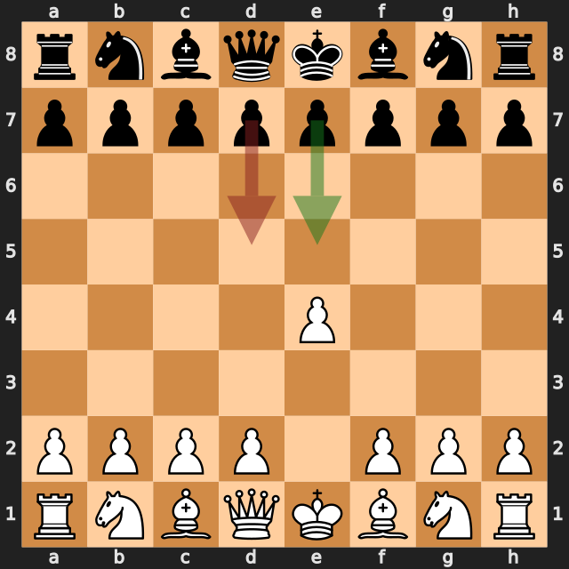
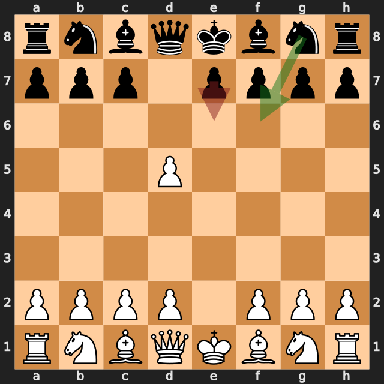
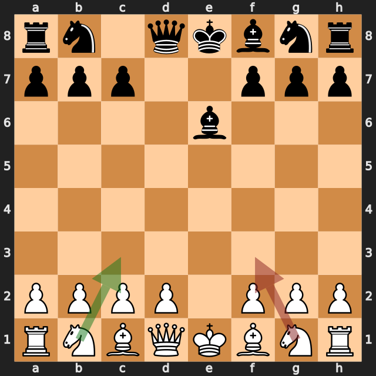
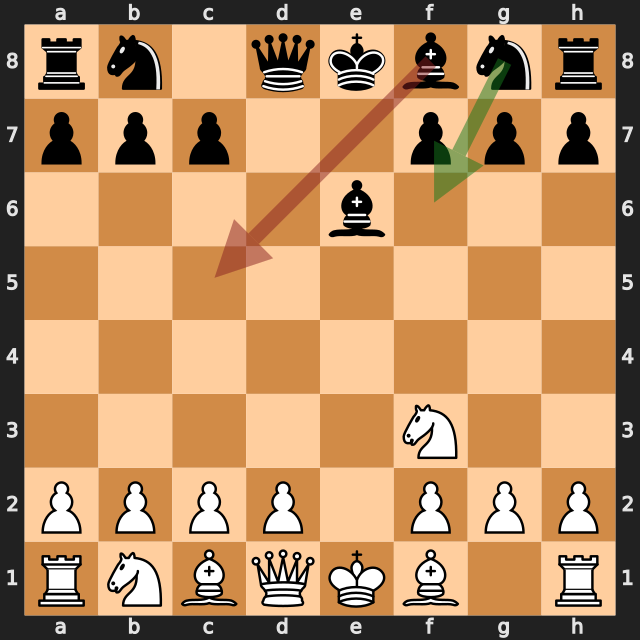
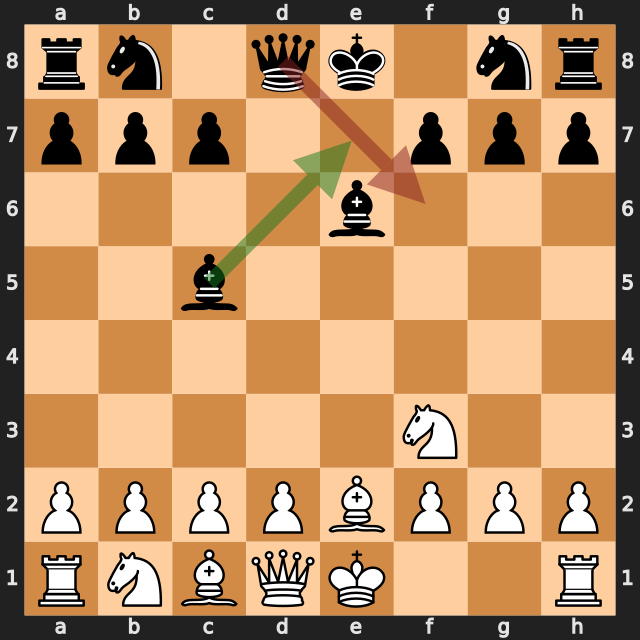
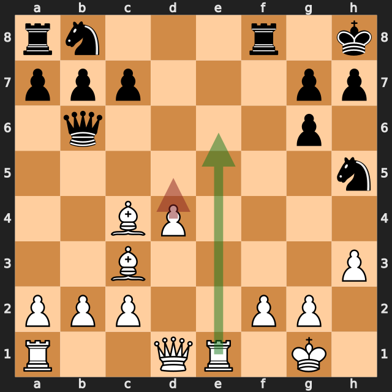

# zbxah vs jawher5241

結果: 0-1 / 日付: 2026.09.25

これはStockfishの計算結果に基づく解説下書きです。候補の選定と戦術・戦略の説明はAIアシスタントで仕上げます。

評価値は常に白視点（＋は白有利）。メイトは数値評価と分けて表示します。

「期待スコア」はsf16モデルによる勝ち＋引き分けの半分の推定値で、人間の勝率ではありません。分類は暫定です。

## 注目局面 1...d5

実戦は **d5**。推奨候補は **e5** です。

推奨候補の評価: +0.17 / 実戦手を選んだ場合: +0.67。

手番側の期待スコアの低下: 9.2ポイント。

推奨手からの参考変化: e5 → Nf3

実戦手からの参考変化: d5 → exd5

<!-- AIアシスタント: PVと盤面で裏付けられる狙い、相手の応手、改善点を説明する。未検証の戦術名や心理を創作しない。 -->

## 注目局面 2...e6

実戦は **e6**。推奨候補は **Nf6** です。

推奨候補の評価: +0.68 / 実戦手を選んだ場合: +1.13。

手番側の期待スコアの低下: 26.2ポイント。

推奨手からの参考変化: Nf6 → d4 → Qxd5 → Nc3 → Qd6 → Nf3

実戦手からの参考変化: e6 → Bb5+ → c6 → dxc6 → bxc6 → Be2

<!-- AIアシスタント: PVと盤面で裏付けられる狙い、相手の応手、改善点を説明する。未検証の戦術名や心理を創作しない。 -->

## 注目局面 4.Nf3

実戦は **Nf3**。推奨候補は **Nc3** です。

推奨候補の評価: +1.09 / 実戦手を選んだ場合: +1.08。

手番側の期待スコアの低下: 0.6ポイント。

推奨手からの参考変化: Nc3 → Nc6

実戦手からの参考変化: Nf3 → Nf6 → d4 → c5 → Bb5+ → Nc6

<!-- AIアシスタント: PVと盤面で裏付けられる狙い、相手の応手、改善点を説明する。未検証の戦術名や心理を創作しない。 -->

## 注目局面 4...Bc5

実戦は **Bc5**。推奨候補は **Nf6** です。

推奨候補の評価: +1.16 / 実戦手を選んだ場合: +2.04。

手番側の期待スコアの低下: 12.0ポイント。

推奨手からの参考変化: Nf6 → d4 → c5 → Bb5+ → Nc6 → Bxc6+

実戦手からの参考変化: Bc5 → d4 → Bb6 → c4 → c6 → Nc3

<!-- AIアシスタント: PVと盤面で裏付けられる狙い、相手の応手、改善点を説明する。未検証の戦術名や心理を創作しない。 -->

## 注目局面 5...Qf6

実戦は **Qf6**。推奨候補は **Be7** です。

推奨候補の評価: +1.95 / 実戦手を選んだ場合: +4.21。

手番側の期待スコアの低下: 0.2ポイント。

推奨手からの参考変化: Be7 → d4

実戦手からの参考変化: Qf6 → d4 → Bb4+ → c3 → Bd6 → O-O

<!-- AIアシスタント: PVと盤面で裏付けられる狙い、相手の応手、改善点を説明する。未検証の戦術名や心理を創作しない。 -->

## 注目局面 18.d5

実戦は **d5**。推奨候補は **Re6** です。

推奨候補の評価: +5.97 / 実戦手を選んだ場合: +1.26。

手番側の期待スコアの低下: 8.5ポイント。

推奨手からの参考変化: Re6 → Nc6 → Qe1 → Rf6 → Re4 → Raf8

実戦手からの参考変化: d5 → Qxf2+

<!-- AIアシスタント: PVと盤面で裏付けられる狙い、相手の応手、改善点を説明する。未検証の戦術名や心理を創作しない。 -->
