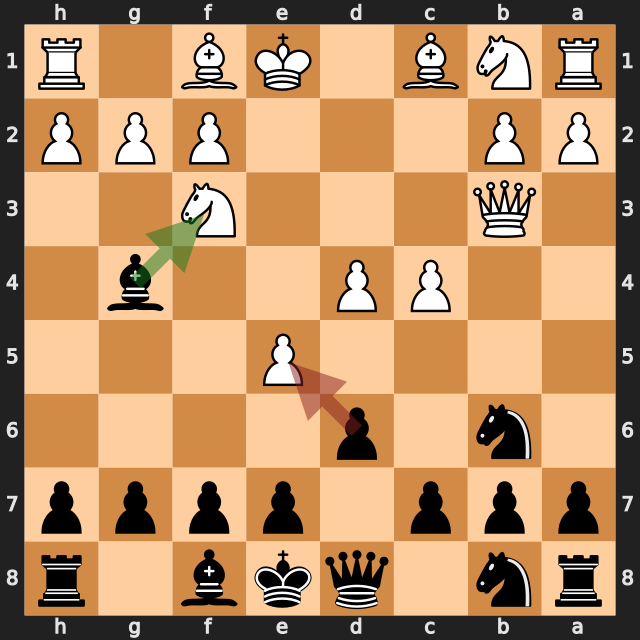
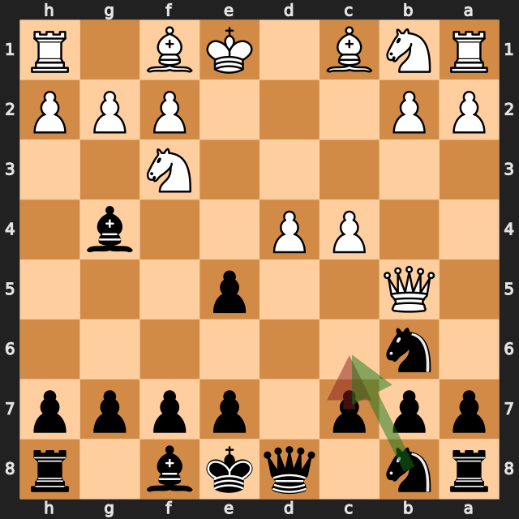
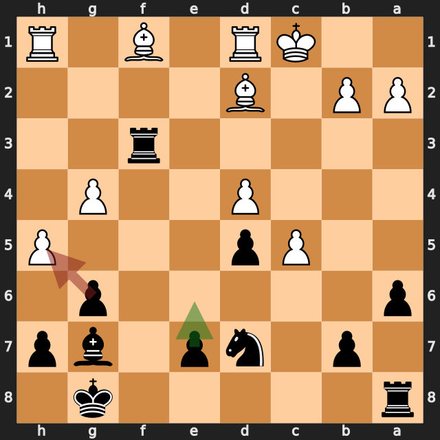
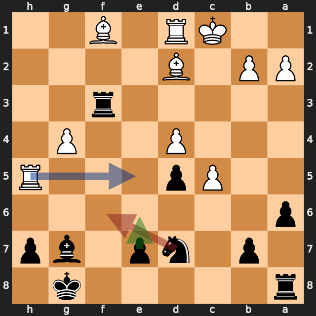
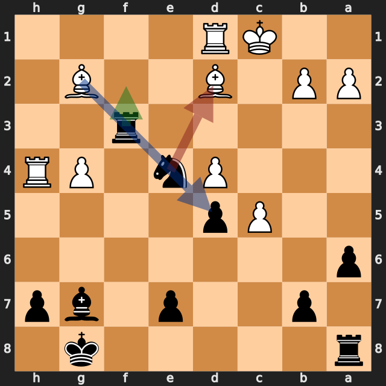

# 追いついた互角を、一手で手放した一局——lichess、黒番の振り返り

[棋譜（PGN）](game.pgn) · [全局面の解析](game.analysis.json) · [重要局面の再確認](verification.analysis.json) · [lichessの対局ページ](https://lichess.org/BiwKteWU)

2026年9月26日／lichess・レーティング戦（30分）／白：pykkis（1709）／黒：筆者（1691）／結果：1–0（27手で黒投了）

アレヒン・ディフェンスの2ポーン・アタック（3.c4 Nb6 4.d4 d6）から始まった一局です。序盤に白の **7.Qb5+?** で黒に大きなチャンスが来ましたが、**7...c6** で見送り、互角に戻りました。中盤は少しずつ押され、白の不正確な手（21.Bd2、22.Rxh5、23.Rh4）で2度も互角に戻したのに、最後は **24...Nxd2?** で駒の並びが崩れ、ポーンを2つ失って投了しました。

以下の評価値はすべて白視点です。プラスが白有利、マイナスが黒（筆者）有利です。数値は今回の探索での目安で、確定的な勝率ではありません。局面図は黒側から見た向きで、指す前の局面です。赤は実戦手、緑は検討候補、青は補足の利き筋を表します。

評価が大きく動いた手を、最善候補との差で並べます（各6秒・MultiPV 4の再確認値）。

| 手 | 指した側 | 最善候補（評価） | 実戦（評価） | 差 |
|---|---|---|---|---|
| **6...dxe5** | 黒（筆者） | Bxf3（+0.30） | dxe5（+1.85） | **約1.6** |
| 7.Qb5+ | 白 | Nxe5（+1.95） | Qb5+（−3.29） | 約5.2 |
| **7...c6** | 黒（筆者） | Nc6（−3.37） | c6（−0.11） | **約3.3** |
| 21.Bd2 | 白 | Kd2（+2.01） | Bd2（+0.28） | 約1.7 |
| **21...gxh5** | 黒（筆者） | e6（+0.29） | gxh5（+2.35） | **約2.1** |
| 22.Rxh5 | 白 | Bg2（+2.40） | Rxh5（+0.27） | 約2.1 |
| **22...Nf6** | 黒（筆者） | e6（+0.36） | Nf6（+2.24） | **約1.9** |
| 23.Rh4 | 白 | Re5（+2.35） | Rh4（−0.01） | 約2.4 |
| **24...Nxd2** | 黒（筆者） | Rf2（−0.06） | Nxd2（+4.62） | **約4.7** |

## 1. ビショップが浮いた——6...dxe5

**5...Bg4 6.Qb3** のあと、最善候補は **6...Bxf3**（約 **+0.30**）で、**6...g6**・**6...Nc6** もほぼ同じ評価でした。実戦の **6...dxe5** は約 **+1.85** です。

理由は **7.Nxe5** です。e5に入ったナイトは、g4のビショップとf7に当たります。g4のビショップを守る黒の駒はありません（python-chessで確認）。解析の参考変化では、黒は **7...Bc8** と戻ることになり、手損が残ります。先に **6...Bxf3** でナイトと交換しておけば、この問題は起きません。

実戦の白は **7.Nxe5** ではなく **7.Qb5+?** と指し、ここで形勢が逆転しました。

**今回の学び：** ポーンを取る前に、相手の駒が取り返しながらどこに当たるかを確認する。守りのない駒（今回はg4のビショップ）は狙われやすい。

## 2. 見送った大チャンス——7...c6（7...Nc6!なら黒優勢）

**7.Qb5+?** は約 **−3.29** で、白の最善候補 **7.Nxe5**（約 +1.95）から約5.2も悪化しました。黒が大きく優勢になるチャンスです。

最善候補は **7...Nc6**（約 **−3.37**）でした。チェックを防ぎながら駒を展開する手で、d4のポーンには、e5のポーン、c6のナイト、d8のクイーン（開いたd列）の3つが当たります。守る白の駒はf3のナイトだけです（python-chessで確認）。参考変化は **8.Nxe5 Qxd4 9.Nxg4 Qxg4** で、黒がポーンを得て、白クイーンはb5で浮いたままです。8.Nxe5以外の白の手（8.c5、8.Nbd2、8.dxe5）も、今回の追加の探索ではいずれも約 −3.4〜−4.0 でした。

実戦の **7...c6** は約 **−0.11** です。白クイーンは **8.Qxe5** でe5のポーンを取り返し、ほぼ互角に戻りました。

**今回の学び：** チェックを受けたら、合い駒の候補を並べて比べる。駒を展開しながら防げる手が、同時に相手の弱点（今回はd4）を攻めることがある。

## 3. 構造を崩した取り——21...gxh5

13...Qb8、14...Qxg3、19...fxg4 などで少しずつ押され、20手目のあとは約 +2 まで白に傾いていました。ここで白の **21.Bd2** は約 **+0.28** で、最善候補の **21.Kd2**（約 +2.01）から大きく悪化しました。黒に互角へ戻す機会が来ています。

最善候補は **21...e6**（約 **+0.29**）です。g6のポーンを残したまま、d5のポーンを支える手です。

実戦の **21...gxh5** は約 **+2.35** です。参考変化は **22.gxh5 e6 23.Be2 Rf2 24.Bg4** で、g4のポーンがなくなったことで、白のビショップがe2からg4へ出る道が開いています。

実戦の白は **22.Rxh5** と指し（約 +0.27）、ふたたび互角に戻りました。

## 4. e5の守りを外した——22...Nf6

ここでも最善候補は **22...e6**（約 **+0.36**）でした。実戦の **22...Nf6** は約 **+2.24** です。

d7のナイトはe5を守っていたので、白のルークはe5に入れませんでした（python-chessで確認）。**22...Nf6** でナイトが離れると、**23.Re5** が可能になります。e7のポーンを守る黒の駒はなく、参考変化 **23.Re5 Rf8 24.Rxe7** では白がポーンを得ます。**22...e6** なら、e7のポーンが先にe6へ進むので、この狙いは生じません。

白は **23.Re5** を指さず、**23.Rh4** で互角（約 −0.01）に戻しました。21手目と22手目で、同じ **...e6** が2回続けて最善候補でした。

**今回の学び：** 駒を動かす前に、その駒が守っているマスを確認する。形を整えるポーンの一手（今回は...e6）が、相手の侵入口をまとめて消すことがある。

## 5. 決定的な一手——24...Nxd2?

**24.Bg2** で、g2のビショップがf3のルークに当たりました。f3のルークを守る黒の駒はありません。最善候補は **24...Rf2**（約 **−0.06**）で、ルークを逃がしながらd2のビショップとg2のビショップに当てる手です。**24...Rg3**・**24...Rd3** もほぼ互角でした。

実戦の **24...Nxd2?** は約 **+4.62** で、約4.7悪化しました。**25.Rxd2** のあとも、f3のルークはg2のビショップに当たったままです。しかもe4のナイトがいなくなったため、g2からd5への斜めを遮るのはf3のルークだけになりました（python-chessで確認）。

実戦は **25...Re3** でルークを逃がしましたが、斜めが開いて **26.Bxd5+ e6 27.Bxb7** と、d5とb7のポーンを続けて取られました。今回の再確認では、**25...Raf8**（約 +4.34）で交換損を受け入れる変化が、評価の上ではやや良い程度で、どちらも白の勝勢です。

**今回の学び：** 駒を交換する前に、交換で空くマスと斜めを確認する。取られそうな駒（今回はf3のルーク）がある局面では、まずその駒を安全にしてから他の手を考える。

## 次の対局で意識したいこと

- **相手の攻めの中心になる駒には、先に交換を考える。** 6...Bxf3なら、7.Nxe5の当たりを避けられました。
- **チェックを受けたら、合い駒を並べて比べる。** 7...Nc6!で、d4に3つの駒が当たる優勢の局面になっていました。
- **駒を動かす前に、その駒の守りと、空く利き筋を確認する。** 22...Nf6?はe5の守りを外し、24...Nxd2?はd5への斜めを開きました。

---

解析：Stockfish 19、1スレッド、Hash 128MB。全局面0.3秒、候補12局面を各2秒・MultiPV 3で解析しました。記事で扱った局面（6...dxe5、7.Qb5+、7...c6、19...fxg4、21.Bd2、21...gxh5、22.Rxh5、22...Nf6、23.Rh4、24...Nxd2、25...Re3）は、各6秒・MultiPV 4で再確認しています。7...Nc6のあとの白の候補は、別に6秒・MultiPV 4で確認しました（ファイルには保存していません）。評価値は本文で明示した探索の値であり、確定的な勝率ではありません。

自動選定の重要局面（6局面：6...dxe5、7.Qb5+、7...c6、21...gxh5、23.Rh4、24...Nxd2）は、すべて本文で扱っています。22...Nf6は自動選定に入りませんでしたが、詳細解析の対象で差が大きいため加えました。6...dxe5の最善候補は、2秒の解析ではg6（+0.32）、6秒の再確認ではBxf3（+0.30）で、上位3手の差はごくわずかです。

このPGNにはlichessの評価コメントが付いておらず、数値はすべて本ツールのStockfishで計算しています。
