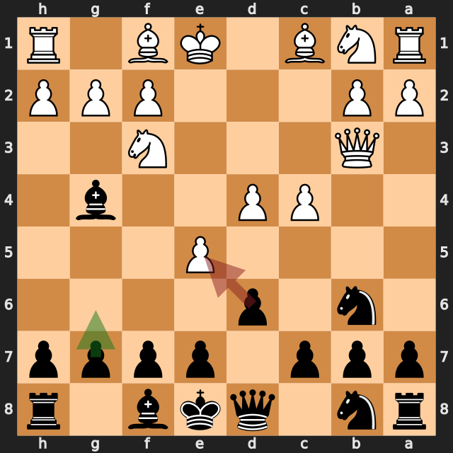
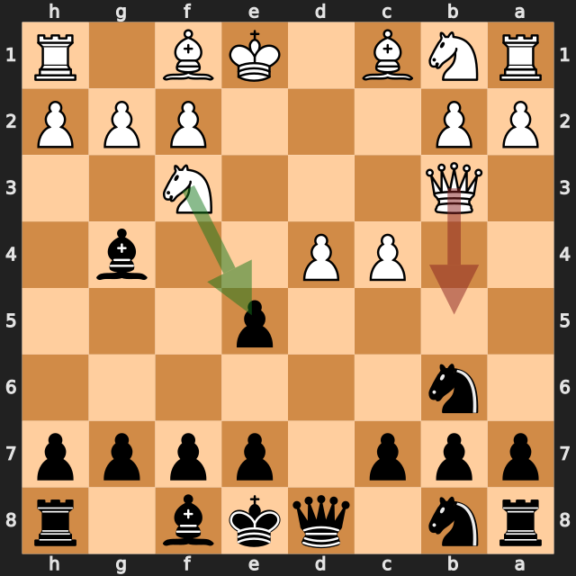
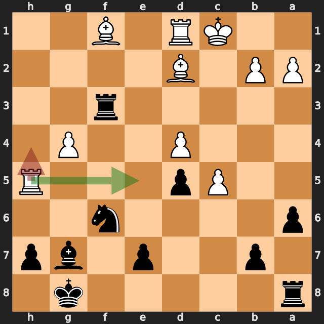
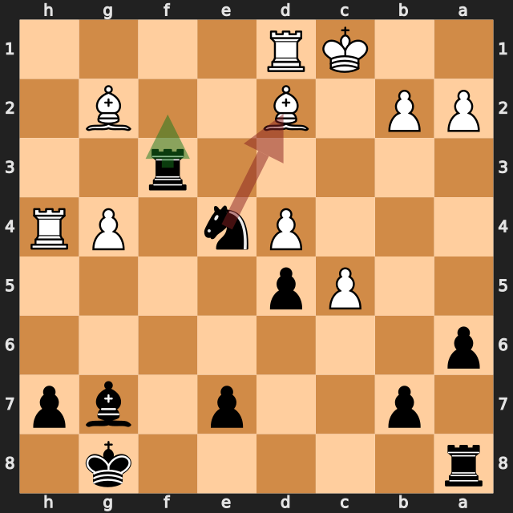

# pykkis vs zbxah

結果: 1-0 / 日付: 2026.09.26

これはStockfishの計算結果に基づく解説下書きです。候補の選定と戦術・戦略の説明はAIアシスタントで仕上げます。

評価値は常に白視点（＋は白有利）。メイトは数値評価と分けて表示します。

「期待スコア」はsf16モデルによる勝ち＋引き分けの半分の推定値で、人間の勝率ではありません。分類は暫定です。

## 注目局面 6...dxe5

実戦は **dxe5**。推奨候補は **g6** です。

推奨候補の評価: +0.32 / 実戦手を選んだ場合: +1.96。

手番側の期待スコアの低下: 48.1ポイント。

推奨手からの参考変化: g6 → exd6 → exd6 → Bg5 → Be7 → Be3

実戦手からの参考変化: dxe5 → Nxe5 → Bc8 → c5 → Nd5 → Bc4

<!-- AIアシスタント: PVと盤面で裏付けられる狙い、相手の応手、改善点を説明する。未検証の戦術名や心理を創作しない。 -->

## 注目局面 7.Qb5+

実戦は **Qb5+**。推奨候補は **Nxe5** です。

推奨候補の評価: +1.82 / 実戦手を選んだ場合: -3.50。

手番側の期待スコアの低下: 99.6ポイント。

第2候補との評価差が大きく、最善候補を見つけることが重要な局面です。唯一手かどうかは追加検証が必要です。

推奨手からの参考変化: Nxe5 → Be6 → Be3 → g6 → Nc3 → Bg7

実戦手からの参考変化: Qb5+ → Nc6 → Nxe5 → Qxd4 → Nxg4 → Qxg4

<!-- AIアシスタント: PVと盤面で裏付けられる狙い、相手の応手、改善点を説明する。未検証の戦術名や心理を創作しない。 -->

## 注目局面 7...c6

実戦は **c6**。推奨候補は **Nc6** です。

推奨候補の評価: -3.21 / 実戦手を選んだ場合: -0.02。

手番側の期待スコアの低下: 49.9ポイント。

第2候補との評価差が大きく、最善候補を見つけることが重要な局面です。唯一手かどうかは追加検証が必要です。

推奨手からの参考変化: Nc6 → Nxe5 → Qxd4 → Nxg4 → Qxg4 → Be3

実戦手からの参考変化: c6 → Qxe5 → N8d7 → Qg3 → Bxf3 → gxf3

<!-- AIアシスタント: PVと盤面で裏付けられる狙い、相手の応手、改善点を説明する。未検証の戦術名や心理を創作しない。 -->

## 注目局面 21...gxh5

実戦は **gxh5**。推奨候補は **e6** です。

推奨候補の評価: +0.39 / 実戦手を選んだ場合: +2.24。

手番側の期待スコアの低下: 48.1ポイント。

第2候補との評価差が大きく、最善候補を見つけることが重要な局面です。唯一手かどうかは追加検証が必要です。

推奨手からの参考変化: e6 → Bc3

実戦手からの参考変化: gxh5 → gxh5 → e6 → Be2 → Rf2 → Bg4

<!-- AIアシスタント: PVと盤面で裏付けられる狙い、相手の応手、改善点を説明する。未検証の戦術名や心理を創作しない。 -->

## 注目局面 23.Rh4

実戦は **Rh4**。推奨候補は **Re5** です。

推奨候補の評価: +2.33 / 実戦手を選んだ場合: +0.00。

手番側の期待スコアの低下: 50.0ポイント。

推奨手からの参考変化: Re5 → Rf8 → Rxe7 → Rf7 → Be2 → Rf2

実戦手からの参考変化: Rh4 → Ne4 → Bg2 → Rf2 → Bxe4 → dxe4

<!-- AIアシスタント: PVと盤面で裏付けられる狙い、相手の応手、改善点を説明する。未検証の戦術名や心理を創作しない。 -->

## 注目局面 24...Nxd2

実戦は **Nxd2**。推奨候補は **Rf2** です。

推奨候補の評価: -0.04 / 実戦手を選んだ場合: +4.40。

手番側の期待スコアの低下: 50.1ポイント。

推奨手からの参考変化: Rf2 → Bxe4 → dxe4 → Bc3 → Rd8 → g5

実戦手からの参考変化: Nxd2 → Rxd2 → Raf8 → Bxf3 → Rxf3 → Rh5

<!-- AIアシスタント: PVと盤面で裏付けられる狙い、相手の応手、改善点を説明する。未検証の戦術名や心理を創作しない。 -->
